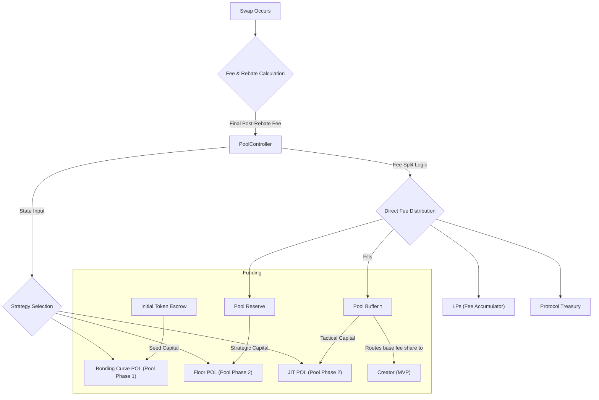

# Pool Controller (Fee Split + Strategy Allocation)

This document specifies the design of the Pool Controller, a per‑pool component responsible for managing economic incentives and allocating protocol‑owned capital across different market‑making strategies.

## 1. Overview

To ensure that each market is healthy, liquid, and sustainable, the protocol needs a system to intelligently manage the resources it collects. The Pool Allocation System acts as the economic control center for each market pool. It is designed to be simple, robust, and responsive to market conditions, balancing the needs of various stakeholders throughout the market's lifecycle.

This system is composed of two primary subsystems:

1.  **The Fee Split System**: Controls how fees from every swap are distributed among the protocol, liquidity providers, the pool creator, and other parties.
2.  **The Strategy Allocation System**: Manages how the pool-owned capital is deployed across different automated market-making strategies as the market matures.

Both subsystems are managed through a proposed on-chain `PoolController` account, which is initialized for each pool. The controller also owns the unified after‑swap pipeline.

### 2.1. Fee Recipients (MVP)

-   **Liquidity Providers (LPs)**: Compensated for providing capital and bearing impermanent loss risk. Their share of fees is added to a global fee accumulator and can be collected by them at any time.
-   **Pool Reserve**: A dedicated, per-pool account that holds strategic capital to back the Floor POL, ensuring the pool's long-term solvency.
-   **Pool Buffer (τ)**: A tactical, per-pool account that funds the active JIT liquidity strategy and may route the creator’s base fee share (MVP) from each swap.
-   **Protocol Treasury**: A global account for funding protocol-wide development and operations.
-   **Pool Creator (MVP base fee)**: Receives a small, fixed percentage of each swap fee as an immediate share (no epoch accounting). The performance‑based bonus is deferred to Phase 2.
-   **Swappers (Phase 2)**: When advanced fees are enabled, equilibrium‑restoring trades can receive rebates (implemented as fee discounts). In MVP, fees are base + impact only and no rebates are paid.

### 2.2. On-Chain Fee Distribution

For simplicity and predictability, the total fee collected from every swap is split according to a fixed, transparent schedule.

**Example Fixed Fee Split:**

| Recipient            | Percentage | Purpose                                             |
| -------------------- | ---------- | --------------------------------------------------- |
| LPs (Accumulator)    | 45%        | Primary reward for liquidity provision.             |
| Pool Reserve         | 25%        | Builds the pool's strategic floor capital.          |
| Pool Buffer (τ)      | 20%        | Funds JIT strategy and tactical needs.              |
| Protocol Treasury    | 8%         | Sustains protocol-wide development.                 |
| Pool Creator (base)  | 2%         | Immediate, fixed share per swap (MVP).              |

### 2.3. Creator Compensation (MVP and Future Market Evolution)

- MVP: A small, fixed base fee share per swap (see split above) is paid immediately. No epoch accounting, no dependency on JIT PnL.
- Future Lending Phase (Deferred): Revisit a performance‑based creator bonus tied to true net profit. The earlier "True Net Profit" model is deferred to avoid complexity at launch. See “Phase 2 (Deferred) — Creator Performance Bonus” below.

Accrual implementation (MVP): To minimize CU, the creator base fee can be accrued to a PoolController‑owned accounting balance and claimed via a `claim_creator_fee` instruction rather than transferred every swap.
Recommended guardrails:
- Enforce a `creator_claim_min_amount` threshold from ProtocolParams to prevent micro‑claims.
- Claim destination is the creator's ATA; claims are idempotent and fail if below threshold.

## 3. Subsystem 2: Strategy Allocation System

This system dictates how the protocol deploys its own capital (Protocol-Owned Liquidity) based on the market's maturity.

### 3.1. Market-Making Strategies

The protocol utilizes three distinct MM strategies during a pool's lifecycle:

1.  **Price Discovery (Staircase)**: A set of 10 deep, weighted liquidity positions deployed at launch to bootstrap the market and establish a stable initial price range.
2.  **Floor Liquidity (Passive)**: A single, large, one-sided liquidity position at the solvency-guaranteed floor price. This is the protocol's primary long-term strategy for providing a price backstop.
3.  **Just-in-Time (JIT) Liquidity (Active)**: Small, reactive, contrarian quotes placed around the current price during a swap to ensure continuous price discovery and capture additional fees.

### 3.2. Allocation Phases

The `PoolController` transitions the pool's protocol‑owned liquidity through two distinct phases.

#### Pool Phase 1: Price Discovery (Bonding Curve)

-   **Trigger**: Activated immediately upon the `deploy_bonding_curve_liquidity` transaction.
-   **Duration**: A fixed period (e.g., 7 days) or until a trading volume milestone is met.
-   **Capital Allocation**:
    -   **Staircase Strategy**: 100% of the initial protocol-owned capital.
    -   **Floor Strategy**: 0% (Inactive).
    -   **JIT Strategy**: 0% (Inactive).
-   **Transition**: At the end of this pool phase, a crank instruction triggers the transition to the Steady-State pool phase. This involves withdrawing all liquidity from the discretized bonding-curve micro-ranges.

#### Pool Phase 2: Steady-State

-   **Trigger**: The conclusion of the Price Discovery pool phase.
-   **Capital Allocation**: The capital recovered from the bonding-curve micro-ranges is re-allocated to the two steady-state strategies:
    -   **Staircase Strategy**: 0% (Decommissioned).
    -   **Floor Strategy**: The vast majority of the capital (~95%) is moved into the `PoolReserve` account to fund the deep, passive floor position.
    -   **JIT Strategy**: A small portion of the capital (~5%) is moved into the `Pool Buffer (τ)` to provide its initial bootstrap funding. The JIT strategy is then sustained by ongoing fees that accrue to the buffer.

### 3.3. Strategy Funding Sources

Each strategy is funded from a source appropriate to its purpose, ensuring a clean separation of capital and risk:

-   **Bonding Curve POL**: Funded by the Initial Token Escrow. This is the one-time seed capital used to bootstrap the pool.
-   **Floor POL**: Funded by the dedicated Pool Reserve account. This represents the pool's own strategic, long-term capital, isolated from all other pools and the main protocol treasury.
-   **JIT POL**: Funded by the local Pool Buffer (tau). This uses tactical, working capital from the pool's own fee revenue to power the active MM strategy.

## 4. On-Chain Implementation

### 4.1. `PoolController` Account

A new `PoolController` account will be created for each pool. It will hold the state for both subsystems.

```rust
#[account]
pub struct PoolController {
    pub pool: Pubkey,
    pub pool_reserve: Pubkey, // Floor capital (PoolReserve)
    pub pool_buffer: Pubkey,  // Tactical funds (PoolBuffer)
    
    // --- Creator Base Fee (MVP) ---
    pub creator_base_fee_bps: u16, // share of each swap fee (part of split)
    
    // --- Strategy Allocation & Phase State ---
    pub current_phase: u8, // 0: PriceDiscovery, 1: SteadyState
    pub discovery_phase_end_timestamp: i64, // End of the discovery phase (optional)

    // --- Launch Window (bootstrap boosts; optional) ---
    pub launch_window_end_ts: i64, // if > now, apply launch presets (buffer split boost, JIT v0 budget boost)
}
```

### 4.2. System Flow

The following diagram illustrates the complete flow of funds. A swap's final, post-rebate fee is processed by the `PoolController`. The controller splits the fee between LPs and the various accounts (PoolReserve, PoolBuffer, Protocol Treasury, Creator). The controller also directs which protocol‑owned strategies are active. The PoolBuffer funds the JIT strategy; the creator bonus is deferred to the Future Lending Phase.



### 4.3. Future Integration: Vaults and Lending (Hooks)

- PoolController will expose a `rebalance_hook()` (crank) to allocate a capped portion of PoolReserve to lending via a protocol DurationVault, respecting:
  - `min_floor_reserve_ratio_bps` (reserve retained for floor)
  - `vault_allocation_cap_bps` (global cap on allocatable reserve)
  - duration bucket constraints from the vault
- This hook is disabled in MVP (feature flag) and does not run during swap; it operates off‑path to avoid CU spikes and simplify safety.

### 4.4. Launch Window Boosts (Optional, MVP)

- For the first `launch_window_hours` after a pool graduates, PoolController may apply a temporary preset:
  - Increase PoolBuffer share (+200 bps) to improve top-of-book depth via JIT v0 funding
  - Reduce creator_base fee (e.g., to 100 bps) to prioritize liquidity bootstrapping
  - Increase JIT v0 budgets (per‑swap/per‑slot) within safe bounds
- After `launch_window_end_ts`, revert to standard ProtocolParams.

## Phase 2 (Deferred) — Creator Performance Bonus

Retain the previously specified “True Net Profit” model for a future phase:

- Formula: `Creator Bonus = payout_% × (Net Buffer Growth − Net JIT Losses)`
- Gate by pool maturity (warmup done) and pay on epoch boundaries.
- Implement as a PoolController payout from PoolBuffer after computing true net profit; include events and per‑epoch snapshots.

These mechanics remain out of MVP to reduce accounting and surface area, but the PoolBuffer and PoolController structures are designed to accommodate them later.
