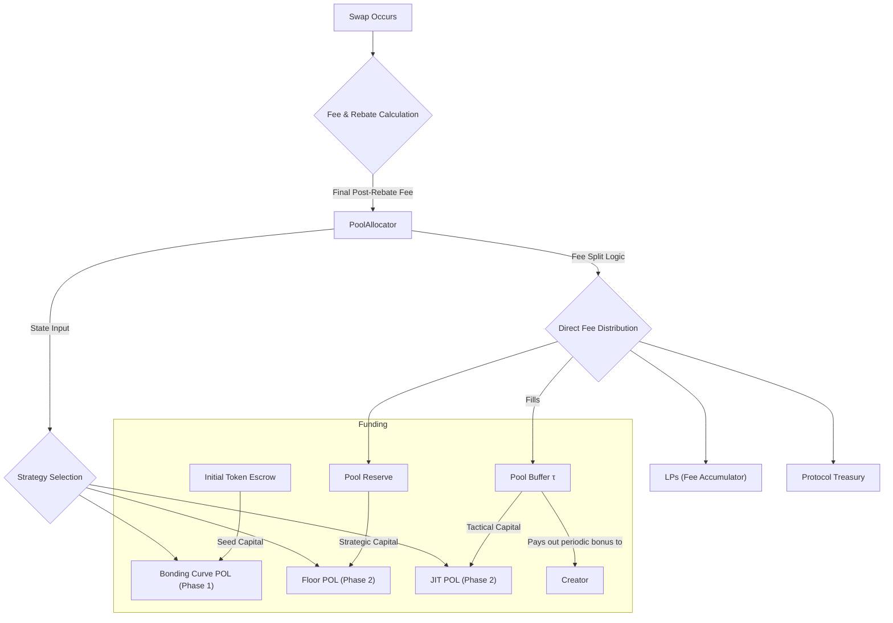

# Pool Controller (Fee Split + Strategy Allocation)

This document specifies the design of the Pool Controller, a per‑pool component responsible for managing economic incentives and allocating protocol‑owned capital across different market‑making strategies.

## 1. Overview

To ensure that each market is healthy, liquid, and sustainable, the protocol needs a system to intelligently manage the resources it collects. The Pool Allocation System acts as the economic control center for each market pool. It is designed to be simple, robust, and responsive to market conditions, balancing the needs of various stakeholders throughout the market's lifecycle.

This system is composed of two primary subsystems:

1.  **The Fee Split System**: Controls how fees from every swap are distributed among the protocol, liquidity providers, the pool creator, and other parties.
2.  **The Strategy Allocation System**: Manages how the pool-owned capital is deployed across different automated market-making strategies as the market matures.

Both subsystems are managed through a proposed on-chain `PoolController` account, which is initialized for each pool. The controller also owns the unified after‑swap pipeline.

### 2.1. Fee Recipients

-   **Liquidity Providers (LPs)**: Compensated for providing capital and bearing impermanent loss risk. Their share of fees is added to a global fee accumulator and can be collected by them at any time.
-   **Pool Reserve**: A dedicated, per-pool account that holds strategic capital to back the Floor POMM, ensuring the pool's long-term solvency.
-   **Pool Buffer (τ)**: A tactical, per-pool account that funds the active JIT liquidity strategy and pays out the creator's periodic performance bonus.
-   **Protocol Treasury**: A global account for funding protocol-wide development and operations.
-   **Pool Creator**: Rewarded for creating healthy, profitable markets via a performance-based share of the pool's true net profit, paid periodically from the Pool Buffer.
-   **Swappers**: Rewarded for making equilibrium-restoring trades via an immediate discount on their swap fee (a rebate), which is accounted for as foregone income to the other recipients.

### 2.2. On-Chain Fee Distribution

For simplicity and predictability, the total fee collected from every swap is split according to a fixed, transparent schedule.

**Example Fixed Fee Split:**

| Recipient          | Percentage | Purpose                                               |
| ------------------ | ---------- | ----------------------------------------------------- |
| LPs (Accumulator)  | 45%        | Primary reward for liquidity provision.               |
| Pool Reserve       | 25%        | Builds the pool's strategic floor capital.        |
| Pool Buffer (τ)    | 20%        | Funds JIT strategy and creator bonus.                 |
| Protocol Treasury  | 10%        | Sustains protocol-wide development.                 |

### 2.3. Creator Performance Bonus: The "True Net Profit" Model

To strongly align the creator's incentives with the long-term health of the pool, the creator receives a periodic bonus based on the pool's net profitability for the protocol over an epoch.

**The Formula:**

$$\text{Creator Bonus} = \text{Payout}_{\%} \times (\text{Net Buffer Growth} - \text{Net JIT Losses})$$

-   **Net Buffer Growth**: The total fees that have accumulated in the Pool Buffer over the epoch.
-   **Net JIT Losses**: The realized profit or loss incurred by the protocol's JIT liquidity strategy over the same epoch. This value is positive if the JIT suffered losses.

This formula means the creator earns a share of the fees only after accounting for any losses from toxic flow that the JIT system absorbed. It directly rewards the creation of healthy, sustainable markets.

**Maturity Gates:**
The creator is not eligible for any performance bonus until the market is considered mature (e.g., the `warmup.done` flag is true and the on-chain oracle is fully populated).

## 3. Subsystem 2: Strategy Allocation System

This system dictates how the protocol deploys its own capital (Protocol-Owned Liquidity) based on the market's maturity.

### 3.1. Market-Making Strategies

The protocol utilizes three distinct MM strategies during a market's lifecycle:

1.  **Price Discovery (Staircase)**: A set of 10 deep, weighted liquidity positions deployed at launch to bootstrap the market and establish a stable initial price range.
2.  **Floor Liquidity (Passive)**: A single, large, one-sided liquidity position at the solvency-guaranteed floor price. This is the protocol's primary long-term strategy for providing a price backstop.
3.  **Just-in-Time (JIT) Liquidity (Active)**: Small, reactive, contrarian quotes placed around the current price during a swap to ensure continuous price discovery and capture additional fees.

### 3.2. Allocation Phases

The `PoolAllocator` transitions the market's POMM through two distinct phases.

#### Phase 1: Price Discovery (Bonding Curve)

-   **Trigger**: Activated immediately upon the `deploy_bonding_curve_liquidity` transaction.
-   **Duration**: A fixed period (e.g., 7 days) or until a trading volume milestone is met.
-   **Capital Allocation**:
    -   **Staircase Strategy**: 100% of the initial protocol-owned capital.
    -   **Floor Strategy**: 0% (Inactive).
    -   **JIT Strategy**: 0% (Inactive).
-   **Transition**: At the end of this phase, a crank instruction triggers the transition to the Steady-State phase. This involves withdrawing all liquidity from the 10 staircase positions.

#### Phase 2: Steady-State

-   **Trigger**: The conclusion of the Price Discovery phase.
-   **Capital Allocation**: The capital recovered from the staircase positions is re-allocated to the two steady-state strategies:
    -   **Staircase Strategy**: 0% (Decommissioned).
    -   **Floor Strategy**: The vast majority of the capital (~95%) is moved into the `PoolReserve` account to fund the deep, passive floor position.
    -   **JIT Strategy**: A small portion of the capital (~5%) is moved into the `Pool Buffer (τ)` to provide its initial bootstrap funding. The JIT strategy is then sustained by ongoing fees that accrue to the buffer.

### 3.3. Strategy Funding Sources

Each strategy is funded from a source appropriate to its purpose, ensuring a clean separation of capital and risk:

-   **Staircase POMM**: Funded by the Initial Token Escrow. This is the one-time seed capital used to bootstrap the market.
-   **Floor POMM**: Funded by the dedicated Pool Reserve account. This represents the pool's own strategic, long-term capital, isolated from all other pools and the main protocol treasury.
-   **JIT POMM**: Funded by the local Pool Buffer (τ). This uses tactical, working capital from the pool's own fee revenue to power the active MM strategy.

## 4. On-Chain Implementation

### 4.1. `PoolController` Account

A new `PoolAllocator` account will be created for each market. It will hold the state for both subsystems.

```rust
#[account]
pub struct PoolController {
    pub pool: Pubkey,
    pub pool_reserve: Pubkey, // Floor capital (PoolReserve)
    pub pool_buffer: Pubkey,  // Tactical funds (PoolBuffer)
    
    // --- Creator Bonus State ---
    pub creator_bonus_payout_pct: u8, // e.g., 15% of true net profit
    pub last_epoch_payout_slot: u64, // Slot of the last bonus calculation
    // Snapshots for calculating epoch-based growth/loss
    pub epoch_start_jit_pnl: i128,
    pub epoch_start_buffer_size: u128,
    
    // --- Strategy Allocation & Phase State ---
    pub current_phase: u8, // 0: PriceDiscovery, 1: SteadyState
    pub discovery_phase_end_timestamp: i64, // End of the discovery phase (optional)
}
```

### 4.2. System Flow

The following diagram illustrates the complete flow of funds. A swap's final, post-rebate fee is processed by the `PoolAllocator`. The allocator's logic splits the fee between LPs and various protocol accounts, including the Pool Buffer. The allocator also directs which POMM strategies are active. The Pool Buffer, in turn, is used to fund the JIT strategy and pay out the creator's periodic bonus.


