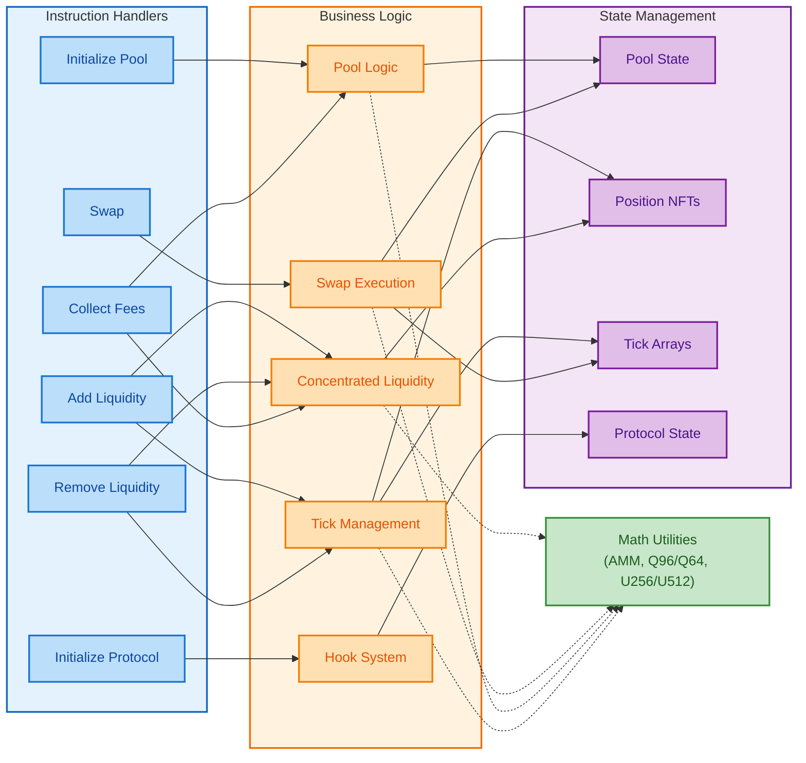
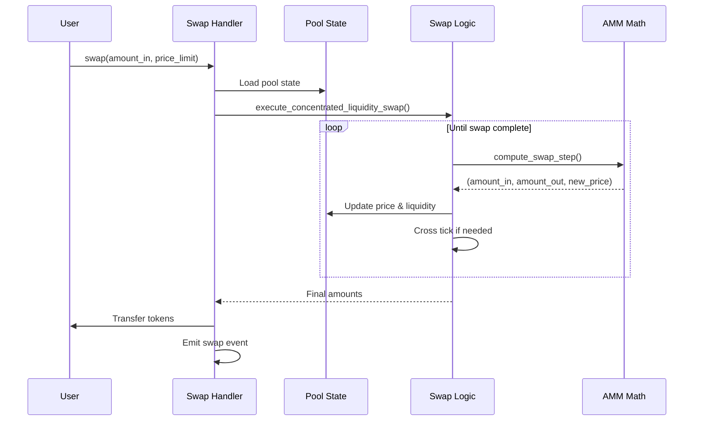
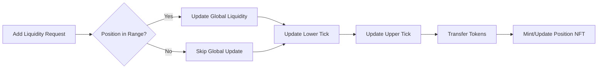

# Feels Protocol Specification

## Overview

The Feels Protocol is a concentrated liquidity automated market maker (AMM) built on Solana, implementing Uniswap V3-style mechanics with several key innovations. The protocol uses FeelsSOL as a universal base pair for all pools, creating a hub-and-spoke liquidity model that simplifies routing and improves capital efficiency.

## Architecture Components

The protocol architecture consists of four primary layers:



### Instruction Layer

The instruction layer provides entry points for all protocol operations. Each instruction handler validates inputs, loads necessary accounts, delegates complex logic to the business layer, and emits events for indexing.

### Business Logic Layer

Complex operations are separated from instruction handlers into focused modules:

- Pool logic handles tick bitmap operations and state queries
- Tick management coordinates liquidity changes across tick boundaries
- Liquidity calculations determine token amounts for positions
- Swap execution implements the core trading algorithm

### State Management

On-chain state is stored in zero-copy accounts for performance:

```rust
// Pool account structure (979 bytes)
pub struct Pool {
    version: u8,                    // Protocol version
    token_a_mint: Pubkey,          // Token A mint
    token_b_mint: Pubkey,          // Always FeelsSOL
    token_a_vault: Pubkey,         // Token A vault PDA
    token_b_vault: Pubkey,         // FeelsSOL vault PDA
    fee_rate: u16,                 // Fee tier (1, 5, 30, 100 bps)
    protocol_fee_rate: u16,        // Protocol's share
    current_tick: i32,             // Current price tick
    current_sqrt_price: u128,      // Square root price Q96
    liquidity: u128,               // Active liquidity
    tick_array_bitmap: [u64; 16],  // Tick search optimization
    // ... additional fields
    _reserved: [u8; 512],          // Future upgrades
}
```

## Control Flow

### Swap Execution Flow

The swap process demonstrates the protocol's layered architecture:



The swap algorithm iterates through price ranges, computing the maximum swap possible within each tick's liquidity. When crossing tick boundaries, it updates the active liquidity by applying the net liquidity change stored at that tick.

### Liquidity Management

Adding liquidity involves multiple coordinated updates:



Positions track liquidity between two price ticks. When the current price is within a position's range, its liquidity is active and contributes to the pool's trading liquidity.

## Mathematical Foundation

### Price and Liquidity Representation

The protocol uses square root price representation for computational efficiency:

```
sqrt_price_x96 = sqrt(amount_token1 / amount_token0) * 2^96
tick = floor(log₁.₀₀₀₁(price))
```

Virtual liquidity for concentrated positions follows:

```
L = sqrt(x * y)
amount_0 = L * (sqrt_price_upper - sqrt_price) / (sqrt_price_upper * sqrt_price)
amount_1 = L * (sqrt_price - sqrt_price_lower)
```

### Fixed-Point Arithmetic

Fee growth tracking uses Q128.128 fixed-point representation:

```rust
// Fee accumulation per unit of liquidity
fee_growth_global += (fee_amount * 2^128) / liquidity

// Position fee calculation
tokens_owed = liquidity * (fee_growth_inside - fee_growth_inside_last) / 2^128
```

This allows precise fee tracking without floating-point operations.

## Key Design Decisions

### FeelsSOL as Universal Base Pair

All pools pair tokens against FeelsSOL, which wraps yield-bearing liquid staking tokens. This design:

- Simplifies routing to at most two hops
- Concentrates liquidity in fewer pools
- Provides automatic yield generation
- Reduces impermanent loss through staking rewards

### Zero-Copy Deserialization

Large state accounts use Anchor's zero-copy feature:

```rust
#[account(zero_copy)]
#[repr(C, packed)]
pub struct Pool {
    // Packed struct layout for direct memory access
}
```

This eliminates serialization overhead for frequently accessed data.

### Tick Bitmap Optimization

Finding the next initialized tick uses a hierarchical bitmap:

```rust
// 1024-bit bitmap tracks initialized tick arrays
tick_array_bitmap: [u64; 16]

// Each bit represents one tick array (88 ticks)
// Total coverage: 1024 * 88 = 90,112 ticks
```

This enables O(1) tick searches within each 64-bit word.

### Transfer Logic Architecture

Token transfers remain inline within instruction handlers rather than centralized. This design supports Phase 2 integration with Valence hooks, where different operations will transition to atomic position vault adjustments at different times:

```rust
// Transfer logic kept inline for Phase 2 Valence hook integration
// Swaps will be first to transition to atomic position vault adjustments
if is_token_0_to_1 {
    transfer(/* ... */)?;
}
```

## Security Considerations

### Overflow Protection

All arithmetic operations use Rust's native checked arithmetic:

```rust
// Native checked operations
let sum = a.checked_add(b).ok_or(PoolError::MathOverflow)?;
let diff = a.checked_sub(b).ok_or(PoolError::ArithmeticUnderflow)?;
let product = a.checked_mul(b).ok_or(PoolError::MathOverflow)?;

// Large number operations use ruint U256/U512
let fee_growth = U256::from(fee_amount) << 128 / U256::from(liquidity);
```

### Slippage Protection

Users specify minimum output amounts and price limits:

```rust
require!(amount_out >= amount_out_minimum, PoolError::ExceedsSlippage);
require!(sqrt_price_limit > 0, PoolError::PriceLimitInvalid);
```

### Authority Controls

Protocol and pool authorities manage critical operations:

- Protocol authority: fee configuration, emergency controls
- Pool authority: pool-specific parameters
- Position owner: liquidity management, fee collection

## Performance Optimizations

### Compute Unit Management

Complex operations like swaps crossing multiple ticks can approach Solana's compute limits. The protocol addresses this through:

- Efficient tick bitmap searches
- Minimal state updates per iteration
- Deferred tick array updates for large swaps

### Account Size Efficiency

State structures are carefully packed to minimize rent costs while maintaining upgrade flexibility:

```rust
const SIZE: usize = 
    8 +     // discriminator
    467 +   // current fields
    512;    // reserved space
```

## Future Extensibility

The protocol reserves 512 bytes in the Pool account for Phase 2/3 features:

- Continuous leverage system
- Three-dimensional liquidity (rate × duration × leverage)
- Dynamic fee adjustments
- Automated position management

This space will accommodate new fields without requiring state migration.

## Event System

All operations emit structured events for off-chain indexing:

```rust
#[event]
pub struct SwapEvent {
    #[index]
    pub pool: Pubkey,
    pub user: Pubkey,
    pub amount_in: u64,
    pub amount_out: u64,
    pub sqrt_price_after: u128,
    pub fee: u64,
}
```

Events enable transaction reconstruction, analytics, and integration with external systems.

## Conclusion

The Feels Protocol implements a sophisticated concentrated liquidity AMM optimized for Solana's architecture. Through careful separation of concerns, efficient state management, and robust mathematical foundations, it provides a scalable platform for decentralized trading with planned evolution toward advanced DeFi primitives.