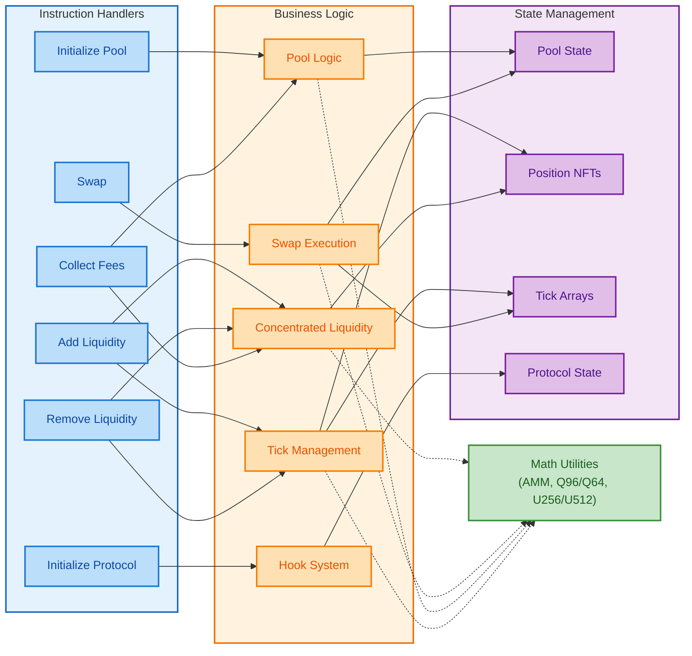
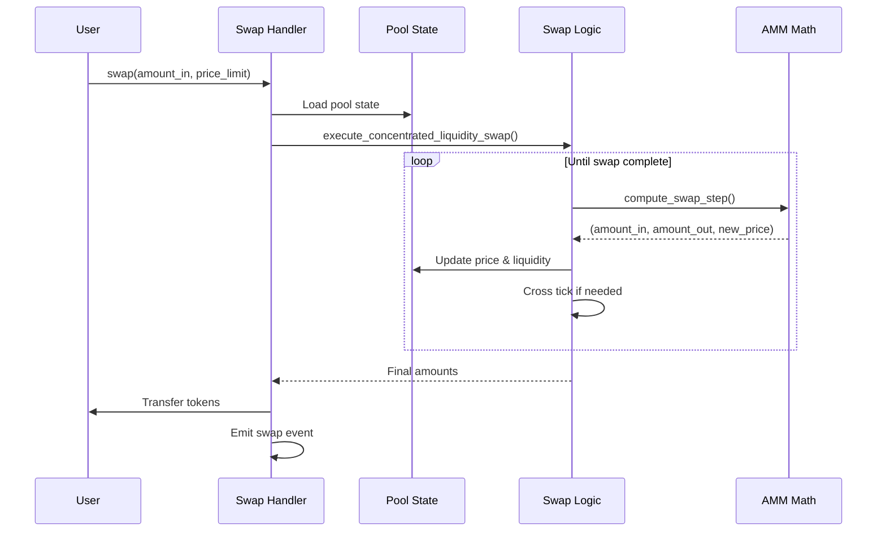
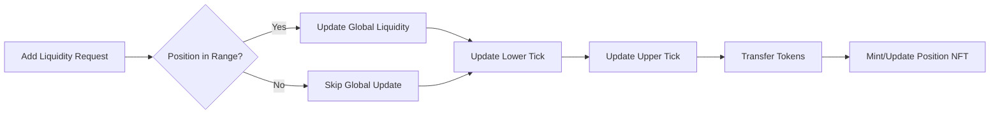

# Feels Protocol Specification

## Table of Contents

1. [Overview](#overview)
2. [Architecture Components](#architecture-components)
3. [State Management](#state-management)
4. [Control Flow](#control-flow)
5. [Mathematical Foundation](#mathematical-foundation)
6. [Key Design Decisions](#key-design-decisions)
7. [Security Considerations](#security-considerations)
8. [Performance Optimizations](#performance-optimizations)
9. [Phase 2 Features](#phase-2-features)
10. [Additional State Structures](#additional-state-structures)
11. [Event System](#event-system)
12. [Liquidity Management System](#liquidity-management-system)
13. [Fee System](#fee-system)
14. [Protocol State and Governance](#protocol-state-and-governance)
15. [FeelsSOL Wrapper System](#feelssol-wrapper-system)
16. [Hook System Architecture](#hook-system-architecture)
17. [Instruction Set Reference](#instruction-set-reference)
18. [Error Handling](#error-handling)
19. [Oracle System](#oracle-system)
20. [Advanced Features](#advanced-features)
21. [Token-2022 Integration](#token-2022-integration)

## Overview

The Feels Protocol is a concentrated liquidity automated market maker (AMM) built on Solana, implementing Uniswap V3-style mechanics with several key innovations. The protocol uses FeelsSOL as a universal base pair for all pools, creating a hub-and-spoke liquidity model that simplifies routing and improves capital efficiency.

## Architecture Components

The protocol architecture consists of four primary layers:



### Instruction Layer

The instruction layer provides entry points for all protocol operations. Each instruction handler validates inputs, loads necessary accounts, delegates complex logic to the business layer, and emits events for indexing.

### Business Logic Layer

Complex operations are separated from instruction handlers into focused modules:

- Pool logic handles tick bitmap operations and state queries
- Tick management coordinates liquidity changes across tick boundaries
- Liquidity calculations determine token amounts for positions
- Swap execution implements the core trading algorithm

### State Management

On-chain state is stored in zero-copy accounts for performance:

```rust
// Pool account structure (zero-copy, packed)
#[account(zero_copy)]
#[repr(C, packed)]
pub struct Pool {
    _padding: [u8; 8],             // Alignment padding
    
    // Token configuration
    token_a_mint: Pubkey,          // Any token mint
    token_b_mint: Pubkey,          // Always FeelsSOL mint
    token_a_vault: Pubkey,         // Token A vault PDA
    token_b_vault: Pubkey,         // FeelsSOL vault PDA
    
    // Fee configuration
    fee_rate: u16,                 // Fee tier (1, 5, 30, 100 bps)
    protocol_fee_rate: u16,        // Protocol's share
    
    // Price and liquidity state
    current_tick: i32,             // Current price tick
    current_sqrt_price: u128,      // Square root price (Q64.96)
    liquidity: u128,               // Total active liquidity
    
    // Tick bitmap (1024-bit)
    tick_array_bitmap: [u64; 16],  // Tick array initialization tracking
    tick_spacing: i16,             // Minimum tick spacing
    _padding2: [u8; 6],            // Explicit padding
    
    // Fee tracking (256-bit integers as [u64; 4])
    fee_growth_global_0: [u64; 4], // Cumulative fees token A
    fee_growth_global_1: [u64; 4], // Cumulative fees token B
    protocol_fees_0: u64,          // Uncollected protocol fees
    protocol_fees_1: u64,          // Uncollected protocol fees
    
    // Metadata
    authority: Pubkey,             // Pool authority
    creation_timestamp: i64,       // Creation time
    last_update_slot: u64,         // Last update slot
    
    // Statistics
    total_volume_0: u128,          // Cumulative volume token A
    total_volume_1: u128,          // Cumulative volume token B
    
    // Phase 2 Extensions (stored in reserved space)
    leverage_params: LeverageParameters,  // When leverage enabled
    position_vault: Option<Pubkey>,       // Automated management vault
    enhanced_oracle: Option<Pubkey>,      // Extended oracle
    dynamic_fee_config: DynamicFeeConfig, // Adjustable fees
    volume_tracker: VolumeTracker,        // Volume statistics
    _reserved: [u8; remaining],           // Remaining reserved space
}
```

## Control Flow

### Swap Execution Flow

The swap process demonstrates the protocol's layered architecture:



The swap algorithm iterates through price ranges, computing the maximum swap possible within each tick's liquidity. When crossing tick boundaries, it updates the active liquidity by applying the net liquidity change stored at that tick.

### Liquidity Management

Adding liquidity involves multiple coordinated updates:



Positions track liquidity between two price ticks. When the current price is within a position's range, its liquidity is active and contributes to the pool's trading liquidity.

## Mathematical Foundation

### Price and Liquidity Representation

The protocol uses square root price representation for computational efficiency:

```
sqrt_price_x96 = sqrt(amount_token_b / amount_token_a) * 2^96
tick = TickMath::get_tick_at_sqrt_ratio(sqrt_price_x96)
```

Virtual liquidity for concentrated positions follows:

```
L = sqrt(x * y)
amount_a = L * (1/sqrt_price - 1/sqrt_price_upper)  // Current price in range
amount_b = L * (sqrt_price - sqrt_price_lower)      // Current price in range
```

### Fixed-Point Arithmetic

Fee growth tracking uses 256-bit integers represented as [u64; 4] arrays:

```rust
// Fee accumulation per unit of liquidity
fee_growth_delta = FeeGrowthMath::fee_to_fee_growth(fee_amount, liquidity)
fee_growth_global = FeeGrowthMath::add_fee_growth(fee_growth_global, fee_growth_delta)

// Position fee calculation (Q128 fixed-point)
tokens_owed = liquidity * (fee_growth_inside - fee_growth_inside_last) / 2^128
```

This allows precise fee tracking without floating-point operations.

## Key Design Decisions

### FeelsSOL as Universal Base Pair

All pools pair tokens against FeelsSOL, which wraps yield-bearing liquid staking tokens. This design:

- Simplifies routing to at most two hops
- Concentrates liquidity in fewer pools
- Provides automatic yield generation
- Reduces impermanent loss through staking rewards

### Cross-Token Routing

The protocol implements efficient routing for non-FeelsSOL pairs:

```rust
pub enum SwapRoute {
    Direct(Pubkey),         // One token is FeelsSOL
    TwoHop(Pubkey, Pubkey), // Route through FeelsSOL
}
```

Two-hop swaps execute atomically:
1. Token A → FeelsSOL (first pool)
2. FeelsSOL → Token B (second pool)

### Zero-Copy Deserialization

Large state accounts use Anchor's zero-copy feature:

```rust
#[account(zero_copy)]
#[repr(C, packed)]
pub struct Pool {
    // Packed struct layout for direct memory access
}
```

This eliminates serialization overhead for frequently accessed data.

### Tick Bitmap Optimization

Finding the next initialized tick uses a hierarchical bitmap:

```rust
// 1024-bit bitmap tracks initialized tick arrays
tick_array_bitmap: [u64; 16]

// Each bit represents one tick array (32 ticks per array)
// Finding next initialized tick uses efficient bit operations
```

This enables O(1) tick searches within each 64-bit word.

### Transfer Logic Architecture

Token transfers remain inline within instruction handlers rather than centralized. This design supports Phase 2 integration with Valence hooks, where different operations will transition to atomic position vault adjustments at different times:

```rust
// Transfer logic kept inline within instruction handlers
// Uses CPI with proper PDA seeds for pool authority
let seeds = &[
    b"pool",
    pool.token_a_mint.as_ref(),
    pool.token_b_mint.as_ref(),
    &pool.fee_rate.to_le_bytes(),
    &[pool_bump],
];
transfer(CpiContext::new_with_signer(/* ... */, &[seeds]), amount)?;
```

## Security Considerations

### Overflow Protection

All arithmetic operations use Rust's native checked arithmetic:

```rust
// Native checked operations
let sum = a.checked_add(b).ok_or(PoolError::MathOverflow)?;
let diff = a.checked_sub(b).ok_or(PoolError::ArithmeticUnderflow)?;
let product = a.checked_mul(b).ok_or(PoolError::MathOverflow)?;

// Large number operations use custom 256-bit math
let fee_growth_delta = FeeGrowthMath::fee_to_fee_growth(fee_amount, liquidity)?;
```

### Slippage Protection

Users specify minimum output amounts and price limits:

```rust
require!(amount_out >= amount_out_minimum, PoolError::SlippageExceeded);
require!(sqrt_price_limit > 0, PoolError::PriceLimitOutsideValidRange);
```

### Authority Controls

Protocol and pool authorities manage critical operations:

- Protocol authority: fee configuration, emergency controls
- Pool authority: pool-specific parameters
- Position owner: liquidity management, fee collection

## Performance Optimizations

### Compute Unit Management

Complex operations like swaps crossing multiple ticks can approach Solana's compute limits. The protocol addresses this through:

- Efficient tick bitmap searches
- Minimal state updates per iteration
- Deferred tick array updates for large swaps

### Account Size Efficiency

State structures are carefully packed to minimize rent costs while maintaining upgrade flexibility:

```rust
// Pool account total size calculation
pub const SIZE: usize = 8 +    // discriminator
    8 +     // padding
    128 +   // token config (4 pubkeys)
    4 +     // fee rates
    36 +    // price/liquidity state
    136 +   // tick bitmap + spacing
    80 +    // fee tracking
    48 +    // metadata
    32 +    // statistics
    512;    // reserved space
// Total: 992 bytes
```

## Phase 2 Features

Phase 2 features are enabled by default in all pools, stored within the reserved space:

```rust
pub struct PoolExtensions {
    leverage_params: LeverageParameters,      // Leverage configuration
    position_vault: Option<Pubkey>,          // Automated management vault
    enhanced_oracle: Option<Pubkey>,         // Extended price oracle
    dynamic_fee_config: DynamicFeeConfig,    // Adjustable fee parameters
    volume_tracker: VolumeTracker,           // Volume statistics
    valence_session: Option<Pubkey>,         // Hook integration
    last_redenomination: i64,                // Redenomination tracking
    redenomination_threshold: u64,           // Trigger threshold
}
```

Only leverage and redenomination features require explicit activation after pool creation.

## Additional State Structures

### Tick Arrays

Ticks are stored in arrays of 32 for efficient access:

```rust
#[account(zero_copy)]
pub struct TickArray {
    pub pool: Pubkey,                   // Associated pool
    pub start_tick_index: i32,          // First tick in array
    pub ticks: [Tick; 32],              // Array of tick data
    pub initialized_tick_count: u8,     // Active tick count
}
```

### Oracle State

Price observations for TWAP calculations:

```rust
#[account(zero_copy)]
pub struct ObservationState {
    pub pool: Pubkey,
    pub observation_index: u16,
    pub cardinality: u16,
    pub last_update_timestamp: i64,
    pub observations: [Observation; 128], // Circular buffer (Phase 1)
}
```

## Event System

All operations emit structured events for off-chain indexing:

```rust
#[event]
pub struct SwapEvent {
    #[index]
    pub pool: Pubkey,
    pub user: Pubkey,
    pub amount_in: u64,
    pub amount_out: u64,
    pub sqrt_price_after: u128,
    pub fee: u64,
}
```

Events enable transaction reconstruction, analytics, and integration with external systems.

## Liquidity Management System

### Position NFTs

Each liquidity position is represented as an NFT with associated metadata:

```rust
#[account]
pub struct TickPositionMetadata {
    pub pool: Pubkey,                      // Associated pool
    pub tick_position_mint: Pubkey,        // NFT mint address
    pub owner: Pubkey,                     // Position owner
    
    pub tick_lower: i32,                   // Lower tick boundary
    pub tick_upper: i32,                   // Upper tick boundary
    pub liquidity: u128,                   // Position liquidity
    
    pub fee_growth_inside_last_0: [u64; 4], // Last recorded fee growth
    pub fee_growth_inside_last_1: [u64; 4], // For fee calculations
    pub tokens_owed_0: u64,                // Uncollected fees
    pub tokens_owed_1: u64,                // Uncollected fees
    
    pub _reserved: [u8; 64],               // Future extensions
}
```

### Liquidity Operations

Adding liquidity involves:
1. Creating or updating tick boundaries
2. Minting position NFT (if new position)
3. Calculating required token amounts
4. Updating pool's active liquidity (if in range)

Removing liquidity reverses the process:
1. Burning liquidity from position
2. Collecting accumulated fees
3. Updating tick boundaries
4. Returning tokens to user

## Fee System

### Fee Structure

The protocol implements a multi-tiered fee system:

```rust
pub struct FeeBreakdown {
    pub swap_fee: u64,      // Base swap fee
    pub protocol_fee: u64,  // Protocol's share
    pub lp_fee: u64,        // LP's share
    pub total_fee: u64,     // Total fee amount
}
```

### Fee Tiers

Supported fee tiers with corresponding tick spacing:
- 0.01% (1 bps) - tick spacing: 1
- 0.05% (5 bps) - tick spacing: 10  
- 0.30% (30 bps) - tick spacing: 60
- 1.00% (100 bps) - tick spacing: 200

### Fee Growth Tracking

Fees accumulate per unit of liquidity using 256-bit precision:
```rust
fee_growth_global_0: [u64; 4]  // Q128.128 fixed-point
fee_growth_global_1: [u64; 4]  // Accumulated fees per liquidity unit
```

## Protocol State and Governance

### Global Protocol Configuration

```rust
#[account]
pub struct ProtocolState {
    pub authority: Pubkey,              // Protocol authority
    pub treasury: Pubkey,               // Fee recipient
    pub default_protocol_fee_rate: u16, // Default protocol share
    pub max_pool_fee_rate: u16,         // Maximum allowed fee
    pub paused: bool,                   // Emergency pause
    pub pool_creation_allowed: bool,    // Pool creation gate
    pub total_pools: u64,               // Statistics
    pub total_fees_collected: u64,      // Lifetime fees
    pub initialized_at: i64,            // Creation timestamp
    pub _reserved: [u8; 128],           // Future upgrades
}
```

### Authority Controls

The protocol implements role-based access:
- **Protocol Authority**: Global configuration, emergency controls
- **Pool Authority**: Pool-specific parameters
- **Position Owner**: Liquidity management, fee collection

## FeelsSOL Wrapper System

### Universal Base Pair

FeelsSOL wraps yield-bearing LSTs to provide:

```rust
#[account]
pub struct FeelsSOL {
    pub underlying_mint: Pubkey,   // JitoSOL or other LST
    pub feels_mint: Pubkey,        // FeelsSOL Token-2022 mint
    pub total_wrapped: u128,       // Total LST wrapped
    pub virtual_reserves: u128,    // Virtual balance for AMM
    pub yield_accumulator: u128,   // Accumulated staking yield
    pub last_update_slot: u64,     // Last yield update
    pub authority: Pubkey,         // Protocol authority
}
```

Benefits:
- Automatic yield generation for liquidity providers
- Reduced impermanent loss through staking rewards
- Simplified routing (all tokens pair with FeelsSOL)
- Efficient capital utilization

## Hook System Architecture

### Hook Registry

External programs can register hooks for custom logic:

```rust
#[account]
pub struct HookRegistry {
    pub pool: Pubkey,
    pub authority: Pubkey,
    pub hooks: [[HookConfig; MAX_HOOKS_PER_TYPE]; 6],
    pub emergency_pause: bool,
    pub _reserved: [u8; 64],
}
```

### Hook Types

Supported hook points:
- **PreSwap**: Validate or modify swap parameters
- **PostSwap**: Execute after swap completion
- **PreAddLiquidity**: Validate liquidity additions
- **PostAddLiquidity**: Track liquidity events
- **PreRemoveLiquidity**: Validate removals
- **PostRemoveLiquidity**: Update external state

### Hook Permissions

```rust
pub enum HookPermission {
    ReadOnly,  // Can only observe
    Modify,    // Can modify non-critical state
    Halt,      // Can block operations
}
```

## Instruction Set Reference

### Core Instructions

| Instruction | Description | Authority |
|------------|-------------|-----------|
| `initialize_protocol` | Deploy protocol singleton | Deployer |
| `initialize_feelssol` | Create FeelsSOL wrapper | Protocol |
| `initialize_pool` | Create new liquidity pool | Protocol |
| `add_liquidity` | Add liquidity to pool | Any user |
| `remove_liquidity` | Remove liquidity position | Owner |
| `swap_execute` | Execute token swap | Any user |
| `execute_routed_swap` | Two-hop swap via FeelsSOL | Any user |
| `collect_fees` | Collect position fees | Owner |
| `collect_protocol_fees` | Collect protocol fees | Protocol |

### Maintenance Instructions

| Instruction | Description | Authority |
|------------|-------------|-----------|
| ~~`keeper_update_tick`~~ | ~~Update tick for keepers~~ | ~~Keeper~~ (REMOVED) |
| `tick_cleanup` | Clean empty tick arrays | Any user |
| `update_protocol_fee_rate` | Adjust protocol fees | Protocol |
| `pause_protocol` | Emergency pause | Protocol |

### Phase 2 Instructions

| Instruction | Description | Authority |
|------------|-------------|-----------|
| `fee_update` | Update dynamic fees | Pool |
| `hook_register` | Register hook program | Pool |
| `leverage_enable` | Enable leverage trading | Pool |
| `execute_redenomination` | Token redenomination | Protocol |
| `token_create` | Create new Token-2022 | Any user |

## Error Handling

The protocol defines granular error codes for debugging:

```rust
#[error_code]
pub enum PoolError {
    // Price/Math Errors
    PriceOutOfBounds,
    MathOverflow,
    ArithmeticUnderflow,
    InvalidSqrtPrice,
    
    // Liquidity Errors
    InsufficientLiquidity,
    LiquidityOverflow,
    InvalidLiquidityDelta,
    
    // Position Errors
    InvalidTickRange,
    PositionNotEmpty,
    InvalidPositionOwner,
    
    // Authority Errors
    InvalidAuthority,
    UnauthorizedOperation,
    
    // Operational Errors
    PoolOperationsPaused,
    InvalidPool,
    SlippageExceeded,
}
```

## Oracle System

### Basic Oracle (Phase 1)

Every pool maintains price observations for TWAP:

```rust
#[account(zero_copy)]
pub struct ObservationState {
    pub pool: Pubkey,
    pub observation_index: u16,
    pub cardinality: u16,
    pub last_update_timestamp: i64,
    pub observations: [Observation; 128],  // Circular buffer
}

pub struct Observation {
    pub timestamp: i64,
    pub sqrt_price_x96: u128,
    pub cumulative_tick: i128,
    pub initialized: u8,
}
```

### Enhanced Oracle (Phase 2)

Extended oracle with volatility tracking:

```rust
#[account]
pub struct EnhancedOracle {
    pub pool: Pubkey,
    pub oracle_data: Pubkey,  // Points to EnhancedOracleData account
    pub observation_index: u16,
    pub cardinality: u16,
    pub volatility_basis_points: u16,
    pub volatility_window: i32,
    pub last_volatility_update: i64,
    pub recent_observations: [EnhancedObservation; 24],
}

// Separate zero-copy account for large observation storage
#[account(zero_copy)]
pub struct EnhancedOracleData {
    pub oracle: Pubkey,
    pub pool: Pubkey,
    pub observations: [EnhancedObservation; 1024], // Extended storage
}
```

Features:
- Volatility calculation for dynamic fees
- Extended observation storage (up to 1024 observations in separate account)
- Configurable time windows
- Real-time price variance tracking

## Advanced Features

### Transient Tick Updates

For gas optimization during large operations:

```rust
#[account(zero_copy)]
pub struct TransientTickUpdates {
    pub pool: Pubkey,
    pub slot: u64,
    pub updates: [TickUpdate; MAX_TICK_UPDATES],
    pub update_count: u8,
    pub finalized: u8,
    pub created_at: i64,
    pub gas_budget_remaining: u32,
    pub _reserved: [u8; 64],
}
```

This system allows:
- Batching multiple tick updates
- Deferred execution for gas savings
- Atomic finalization of changes
- Maximum 20 updates per batch

### Leverage System (Opt-in)

Continuous leverage positions with controlled risk:

```rust
pub struct LeverageParameters {
    pub enabled: bool,
    pub max_leverage: u8,         // Maximum allowed (e.g., 3x)
    pub maintenance_margin: u16,  // Basis points (e.g., 500 = 5%)
    pub liquidation_fee: u16,     // Liquidator reward
    pub insurance_fund: Pubkey,   // Risk backstop
}
```

### Position Vault System

Automated liquidity management for optimized returns:

```rust
#[account]
pub struct PositionVault {
    pub pool: Pubkey,
    pub authority: Pubkey,
    pub protocol_owned_liquidity: u128,
    pub user_deposits: u128,
    pub total_shares: u128,
    pub rebalance_config: RebalanceConfig,
    pub last_rebalance_slot: u64,
    pub total_fees_earned: u128,
    pub performance_fee_rate: u16,
    pub active_positions: [Option<PositionRange>; 10],
}
```

Features:
- Automated position rebalancing
- Multiple active ranges
- Performance fee structure
- JIT liquidity capabilities

### Redenomination System (Opt-in)

Token supply adjustments without disrupting positions:

```rust
// Triggered when price moves beyond threshold
if pool.should_redenominate() {
    execute_redenomination(
        &mut pool,
        redenomination_factor,
        &mut position_updates,
    )?;
}
```

Benefits:
- Maintains readable token prices
- Preserves position values
- Transparent to users
- Automatic trigger mechanism

## Token-2022 Integration

The protocol leverages Token-2022 extensions:

### Supported Extensions
- **Transfer Fees**: Enable fee-on-transfer tokens
- **Interest Bearing**: Support rebasing tokens
- **Permanent Delegate**: Protocol control for safety
- **Transfer Hook**: Custom transfer logic
- **Metadata Pointer**: Rich token information

### Token Creation

Users can create new tokens with built-in liquidity:
```rust
pub fn token_create(
    ctx: Context<CreateToken>,
    params: CreateTokenParams,
) -> Result<()>
```

This enables:
- One-click token launch with liquidity
- Built-in rug protection via locked liquidity
- Automatic FeelsSOL pairing
- Metadata and social links

## Conclusion

The Feels Protocol implements a sophisticated concentrated liquidity AMM optimized for Solana's architecture. Through careful separation of concerns, efficient state management, and robust mathematical foundations, it provides a scalable platform for decentralized trading with planned evolution toward advanced DeFi primitives.