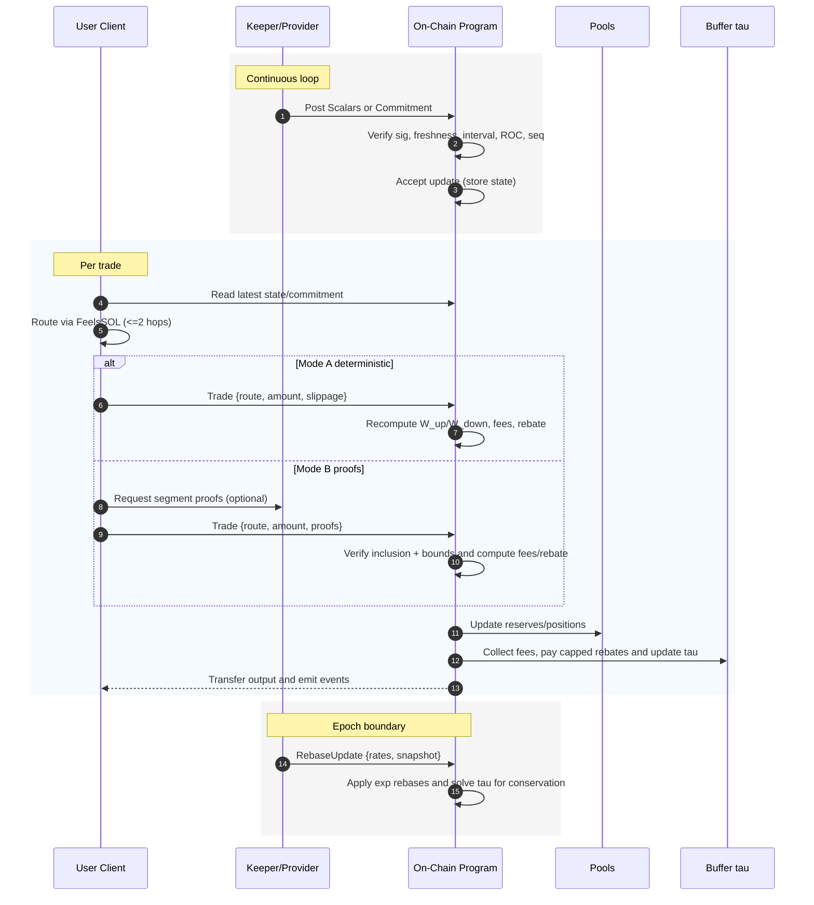

# System Overview

Feels is a hybrid DeFi protocol that combines spot exchange, lending, and leverage. The market structure draws inspiration from thermodynamic models. This document explains how modeling spot trading, lending, and leverage as dimensions in a unified energy landscape enables coherent cross-domain pricing, natural arbitrage relationships, and value-conserving fee structures. We explore the mathematical foundations, dimensional value functions, and trust-minimized architecture that makes this physics-based approach both theoretically sound and practically implementable on-chain.

## Introduction

The Feels Protocol implements a unified 3D AMM that combines spot exchange, lending (time dimension), and leveraged trading under a single thermodynamic framework. Rather than bolting together three disparate markets, we implement one coherent system grounded in a single potential function and strict conservation laws.

The protocol unifies three domains in one AMM: spot exchange, time (lending), and leverage. The design treats market state as a point on an energy landscape and uses conservation to settle flows without creating or destroying value. This allows instantaneous changes (trades) to be priced by how they move the system on the landscape, while continuous effects (interest and funding) act over time to relax the system toward balance.

## Why Thermodynamics?

Thermodynamics provides the unifying model for Feels: markets tend toward equilibrium like physical systems, so we represent state on an energy landscape and price trades by their change in potential; strict conservation prevents value leakage and enables exact, auditable accounting; and unifying spot, time (lending), and leverage as dimensions of one landscape yields coherent cross‑domain pricing, natural arbitrage relationships, and continuous rebalancing, where uphill moves pay fees and downhill moves can earn capped rebates—implemented efficiently and verifiably on‑chain.

## State and Potential

Market state is represented by three value functions $S$, $T$, and $L$. These are combined into a trading invariant:

$$K_{\text{trade}} = S^{\hat{w}_s} \cdot T^{\hat{w}_t} \cdot L^{\hat{w}_l}$$

and a potential:

$$V = -\ln(K_{\text{trade}}) = -\hat{w}_s \ln S - \hat{w}_t \ln T - \hat{w}_l \ln L$$

Here $S, T, L > 0$ are domain value functions measured in a common numeraire, and $\hat{w}_s, \hat{w}_t, \hat{w}_l \ge 0$ are normalized domain weights with $\hat{w}_s+\hat{w}_t+\hat{w}_l=1$. Lower potential corresponds to a more balanced state. The gradient of $V$ represents local resistance. Moving uphill increases potential; moving downhill reduces it. Instantaneous fees are tied to the change in potential along the executed path. Continuous rebalancing acts like heat flow and is modeled with exact exponentials under conservation. Domain weights $\hat{w}_\bullet$ apply to $(S,T,L)$ in $K_{\text{trade}}$, while component weights $w_{S,i}$, $w_{T,d}$, and $w_{L,i}$ live inside each domain’s value function and each set sums to 1.

## Symbol Table

| Symbol | Description |
|--------|-------------|
| $S, T, L$ | Domain value functions in a common numeraire (spot, time, leverage) |
| $\hat{w}_s, \hat{w}_t, \hat{w}_l$ | Normalized domain weights ($\ge 0$, sum to 1) |
| $K_{\text{trade}}$ | Trading invariant $S^{\hat{w}_s} T^{\hat{w}_t} L^{\hat{w}_l}$ |
| $V$ | Potential $-\ln K_{\text{trade}}$ (lower is more balanced) |
| $D, C_i, \rho_i, w_i$ | Template variables: $D$ (generic domain value), $C_i$ (component capacity), $\rho_i$ (component risk), $w_i$ (component weights in the template, mapping to $w_{S,i}, w_{T,d}, w_{L,i}$ per domain) |
| $x_a, x_b$ | Pool inventories (units of assets $a$ and $b$) |
| $p_a, p_b$ | Internal TWAP prices in the common numeraire |
| $w_{S,i}, w_{T,d}, w_{L,i}$ | Component weights within spot/time/leverage domains (each set sums to 1) |
| $I_S, I_T, I_L$ | Index sets — $I_S=\{a,b\}$, $I_T$ = duration buckets, $I_L=\{\text{long},\text{short}\}$; default $w_{L,\text{long}}=w_{L,\text{short}}=1/2$ |
| $\rho_S$ | Spot risk $= \sigma_{price}\,\sqrt{\Delta t}$ with realized volatility $\sigma_{price}$ over window length $\Delta t$ (years) |
| $\rho_T(d)$ | Time risk per bucket $= \sigma_{\text{rate}}\,\sqrt{d}$ (dimensionless) |
| $\rho_L$ | Leverage risk $= \sigma_{\text{leverage}}\,|\text{skew}|$ (dimensionless) |
| $d$ | Duration bucket (years) |
| $T_{\text{lend}}(d), T_{\text{borrow}}(d)$ | Lending/borrowing notionals |
| $\sigma_{\text{rate}}$ | Annualized interest‑rate volatility (per $\sqrt{\text{year}}$) |
| $L_{\text{long}}, L_{\text{short}}$ | Long/short position capacities; $\text{skew}\in[-1,1]$; $\sigma_{\text{leverage}}$: annualized position volatility |
| $w_i, g_i, \tau$ | Conservation: $w_i$ (snapshot participation weights), $g_i$ (multiplicative growth factors), $\tau$ (pool buffer) |

## Dimensional Value Functions and Market Discovery

We express each domain as a weighted geometric mean of component capacities penalized by a dimensionless risk term:

$$D = \prod_{i} \left( \frac{C_i}{\sqrt{1 + \rho_i^2}} \right)^{w_i}, \quad \sum_i w_i = 1$$

where $C_i$ is the component capacity and $\rho_i$ is the component risk in that domain. If all $\rho_i$ in a domain are equal ($\rho_i = \rho$), the penalty can be factored into a single outside term via $\prod_i (1+\rho^2)^{w_i} = (1+\rho^2)$.

### Spot Dimension Value Function

The spot dimension maintains capacity through risk‑scaled inventory values in each leg:

$$S = \prod_{i\in I_S} \left( \frac{x_i p_i}{\sqrt{1 + \rho_S^2}} \right)^{w_{S,i}}, \quad \sum_{i\in I_S} w_{S,i} = 1, \quad \rho_S = \sigma_{price}\,\sqrt{\Delta t}$$

where $x_i$ are pool inventories, $p_i$ are internal TWAP prices in the common numeraire, $w_{S,i}\ge 0$ sum to one, and $\rho_S$ is the spot risk with realized volatility $\sigma_{price}$ over window length $\Delta t$ (years). This is algebraically equivalent to the prior single‑denominator form because $\rho_S$ is common across legs.

**Market Discovery**: Price discovery reveals the marginal exchange rate and the price–quantity curve along the bonding curve, with slippage indicating available liquidity. Active depth concentrates around the current tick while effective depth spans nearby ticks.

### Time Dimension Value Function

The time dimension balances lending and borrowing across durations:

$$T = \prod_{d\in I_T} \left(\frac{\sqrt{T_{\text{lend}}(d)\,T_{\text{borrow}}(d)}}{\sqrt{1 + \rho_T(d)^2}}\right)^{w_{T,d}}, \quad \sum_{d\in I_T} w_{T,d} = 1, \quad \rho_T(d) = \sigma_{\text{rate}}\,\sqrt{d}$$

where $d$ indexes fixed duration buckets measured in years, $w_{T,d} \ge 0$ are bucket weights with $\sum_d w_{T,d} = 1$, $T_{\text{lend}}(d)$ and $T_{\text{borrow}}(d)$ are lending and borrowing notionals in the common numeraire, and $\rho_T(d)$ uses annualized interest‑rate volatility $\sigma_{\text{rate}}$ (per $\sqrt{\text{year}}$) to yield a dimensionless penalty.

**Market Discovery**: Rate discovery reveals the time‑value curve that equilibrates deposits and debt across the term structure. Utilization ratios indicate lending capacity and borrowing demand.

### Leverage Dimension Value Function

The leverage dimension captures directional exposure capacity with symmetric components:

$$L = \prod_{i\in I_L} \left( \frac{L_i}{\sqrt{1 + \rho_L^2}} \right)^{w_{L,i}}, \quad \sum_{i\in I_L} w_{L,i} = 1, \quad \rho_L = \sigma_{\text{leverage}}\,|\text{skew}|$$

where $L_{\text{long}}$ and $L_{\text{short}}$ represent long and short position capacities, $\text{skew} \in [-1,1]$ measures directional imbalance, and $\sigma_{\text{leverage}}$ is annualized position volatility. By default we use equal component weights $w_{L,\text{long}} = w_{L,\text{short}} = 1/2$, which recovers the earlier simplified expression $\sqrt{L_{\text{long}}L_{\text{short}}}/\sqrt{1+\rho_L^2}$, since $\prod L_i^{1/2} = \sqrt{L_{\text{long}}L_{\text{short}}}$ and the common risk factor yields a single $\sqrt{1+\rho_L^2}$ in the denominator.

**Market Discovery**: Funding discovery reveals the rate that rebalances long and short interest and bounds effective leverage capacity. Directional skew drives funding payments and capacity constraints.

## Routing Model

All pools are quoted against the FeelsSOL hub, yielding a hub‑and‑spoke topology with bounded path length:

- Token↔Token: Route as $A \to \text{FeelsSOL} \to B$ (max 2 hops; 1 hop if one side is FeelsSOL).
- Entry/Exit: $\text{JitoSOL} \leftrightarrow \text{FeelsSOL}$ (single hop at the hub).
- FeelsSOL↔Position: Single domain transition into or out of a position token (Time or Leverage).
- Position↔Position: Default via hub in two hops $\text{Pos}_X \to \text{FeelsSOL} \to \text{Pos}_Y$; optionally a direct intra‑domain “morph” may be enabled and treated as a single domain transition.

Segmentation vs. hops: “Segmented trades” refers to size‑based segmentation along a bonding curve within a hop; it does not add extra hops. Path length is bounded by the hub, while the number of segments can increase for large notionals.

## Value Conservation

The system continuously settles the joint value function for each market using multiplicative rebasing with exact exponentials. Each rebase respects a subdomain conservation identity of the form:

$$\sum_i w_i \ln g_i = 0$$

where $w_i$ are snapshot participation weights and $g_i$ are multiplicative growth factors for each participant in the subdomain. The protocol buffer $\tau$ participates as needed and is adjusted to satisfy conservation exactly. This keeps accounting precise and auditable: fees and rebates change who holds value without changing the total.

## Computational Model: Phased Evolution

The Feels protocol is designed with a phased evolution for its computational architecture. The initial phase is fully autonomous and on-chain, with future phases introducing an optional, trust-minimized off-chain provider to enable more complex thermodynamic calculations.

### Phase 1: Fully On-Chain and Autonomous (Current Implementation)

In the current implementation, the system is self-contained and does not rely on any off-chain providers for core logic.

*   **Client (off-chain):** Simulates trades using the latest state fetched directly from on-chain accounts. Submits transactions with slippage limits.
*   **Program (on-chain):** Performs all critical computations deterministically during the swap. This includes:
    *   Calculating dynamic fees based on realized price impact, market momentum, and distance from the on-chain GTWAP.
    *   Updating the on-chain GTWAP oracle with a new observation after every swap.
    *   Executing the swap by iterating through the on-chain tick arrays.

This model prioritizes decentralization and trustlessness, as all logic is executed transparently on the Solana network.

### Phase 2/3: Hybrid Model with Off-Chain Provider (Future Vision)

To enable the full 3D thermodynamic model (Spot, Time, and Leverage), a future version of the protocol may introduce a hybrid computational model involving an off-chain "Keeper". This allows for more computationally intensive modeling than is feasible within a single Solana transaction.

*   **Keeper (off-chain):** Would be responsible for aggregating complex market metrics (e.g., cross-chain volatility, full-market skew) to compute the high-level `S, T, L` domain scalars. It would then post this state to the chain in a compressed format (either as raw scalars or as cryptographic commitments).
*   **Program (on-chain):** The on-chain program's role would shift from *computation* to *verification*. It would:
    *   Verify the Keeper's signature, data freshness, and adherence to rate-of-change limits.
    *   Use the verified scalars to calculate fees based on thermodynamic "Work".
    *   Verify inclusion proofs against posted commitments for large, segmented trades.

This future architecture would trade some autonomy for significantly greater computational power, enabling a more sophisticated and capital-efficient unified market. The transition between these phases will be a major protocol upgrade, shifting the core engine from on-chain calculation to on-chain verification.

## System Lifecycle

Having established the computational roles and trust boundaries, we now examine how these components interact dynamically to execute trades and maintain system integrity. The lifecycle orchestrates three primary flows: the keeper's continuous market monitoring and state updates, users' bounded-route trading through the FeelsSOL hub, and periodic conservation-preserving rebases that settle accumulated effects across all domains. This coordination ensures the thermodynamic model operates efficiently while maintaining cryptographic security and economic safety bounds.

1. Keeper posts signed updates on a schedule with freshness, cadence, ROC, and sequence constraints; chain accepts only valid updates.
2. User routes via FeelsSOL with MAX_ROUTE_HOPS=2; large trades may be segmented within each hop; chain enforces caps and κ clamp.
3. Trades adjust pool state and τ; at epoch boundaries, rebasing applies exact exponentials with conservation (Σ w_i ln g_i = 0).
