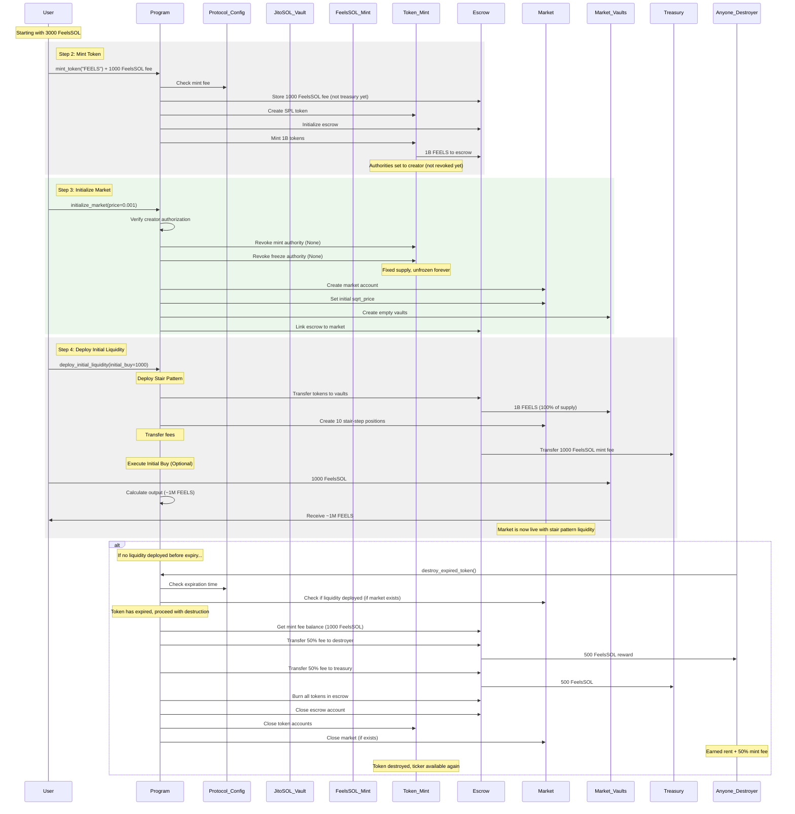

# Token Launch Sequence

This document details the complete process of launching a new token on the Feels Protocol, from acquiring FeelsSOL through token minting, market initialization, and liquidity deployment via a bonding curve, through graduation to steady state.

## Step 1: Convert JitoSOL to FeelsSOL

The first step is to acquire FeelsSOL, the protocol's hub token. All markets in the Feels Protocol require one side of the pair to be FeelsSOL.

### Instruction: `enter_feelssol`

Parameters:
- `amount: u64` - Amount of JitoSOL to deposit

### Accounts

| Account | Description |
|---------|-------------|
| `user` | Signer, must be a system account |
| `user_jitosol` | User's JitoSOL token account |
| `user_feelssol` | User's FeelsSOL token account |
| `jitosol_mint` | JitoSOL mint |
| `feelssol_mint` | FeelsSOL mint |
| `jitosol_vault` | Protocol's JitoSOL vault (PDA: `[b"jitosol_vault", feelssol_mint]`) |
| `mint_authority` | PDA that controls FeelsSOL minting (`[b"mint_authority", feelssol_mint]`) |
| `token_program` | SPL Token program |
| `system_program` | System program |

Process:
1. Transfers JitoSOL from user to protocol vault
2. Mints FeelsSOL 1:1 to user
3. Emits FeelsSOLMinted event

## Step 2: Mint Protocol Token

Create a new SPL token with all supply allocated to the protocol escrow. Requires payment of protocol mint fee.

### Instruction: `mint_token`

Parameters (MintTokenParams):
- `ticker: String` - Token symbol (max 10 chars)
- `name: String` - Token name (max 32 chars)
- `uri: String` - Metadata URI (max 200 chars)

### Accounts

| Account | Description |
|---------|-------------|
| `creator` | Signer, must be a system account |
| `token_mint` | New token mint to create (signer) |
| `escrow` | Pre-launch escrow account for this token (PDA: `[b"escrow", token_mint]`) |
| `escrow_token_vault` | Escrow's token vault (ATA) |
| `escrow_feelssol_vault` | Escrow's FeelsSOL vault (ATA) |
| `escrow_authority` | PDA controlling escrow vaults (`[b"escrow_authority", escrow]`) |
| `metadata` | Metaplex metadata account (PDA) |
| `feelssol_mint` | FeelsSOL mint |
| `creator_feelssol` | Creator's FeelsSOL account (must have mint fee balance) |
| `protocol_config` | Protocol configuration account (PDA: `[b"protocol_config"]`) |
| `protocol_token` | Protocol token registry entry (PDA: `[b"protocol_token", token_mint]`) |
| `associated_token_program` | Associated Token program |
| `rent` | Rent sysvar |
| `token_program` | SPL Token program |
| `system_program` | System program |
| `metadata_program` | Metaplex Token Metadata program |

Process:
1. Validate parameters early (ticker ≤ 10 chars, name ≤ 32 chars, URI ≤ 200 chars)
2. Validate creator has at least mint fee balance (amount specified in protocol_config)
3. Creates new SPL token with 6 decimals
4. Mints entire supply (1,000,000,000 tokens) to escrow
5. Creates Metaplex metadata
6. Mint and freeze authorities initially set to creator (revoked during market initialization)
7. Transfers mint fee from creator to escrow (held until market success or expiration)
8. Initializes PreLaunchEscrow state with token mint info
9. Creates ProtocolToken registry entry marking creator as authorized market launcher

## Step 3: Initialize Market

Create a new trading market pairing the protocol token with FeelsSOL. Only the token creator can perform this step.

### Instruction: `initialize_market`

Parameters (InitializeMarketParams):
- `base_fee_bps: u16` - Trading fee in basis points (e.g., 30 = 0.3%)
- `tick_spacing: u16` - Tick spacing for positions
- `initial_sqrt_price: u128` - Initial price as sqrt(price) * 2^64
- `initial_buy_feelssol_amount: u64` - Set to 0 (initial buy happens during deployment)

### Accounts

| Account | Description |
|---------|-------------|
| `creator` | Signer, must match token creator |
| `token_0` | Lower pubkey mint (FeelsSOL or protocol token) |
| `token_1` | Higher pubkey mint (FeelsSOL or protocol token) |
| `market` | Market account to create (PDA: `[b"market", token_0, token_1]`) |
| `buffer` | Market Buffer account (PDA: `[b"buffer", market]`) |
| `oracle` | Market Oracle state account (PDA: `[b"oracle", market]`) |
| `vault_0` | Token 0 vault (PDA: `[b"vault", token_0, token_1, b"0"]`) |
| `vault_1` | Token 1 vault (PDA: `[b"vault", token_0, token_1, b"1"]`) |
| `market_authority` | PDA controlling vaults (`[b"market_authority", market]`) |
| `feelssol_mint` | FeelsSOL mint |
| `protocol_token_0` | Protocol token registry for token_0 (or dummy if FeelsSOL) |
| `protocol_token_1` | Protocol token registry for token_1 (or dummy if FeelsSOL) |
| `escrow` | Pre-launch escrow for the protocol token |
| `creator_feelssol` | Creator's FeelsSOL account (for validation) |
| `creator_token_out` | Creator's token account (for validation) |
| `system_program` | System program |
| `token_program` | SPL Token program |
| `rent` | Rent sysvar |

Process:
1. Validate tick spacing and fee tier parameters early
2. Validates token order (lower pubkey must be token_0)
3. Ensures at least one token is FeelsSOL
4. Verifies creator authorization for protocol-minted tokens
5. Revokes mint and freeze authorities for protocol-minted tokens (set to None)
6. Initializes Market state with initial price and configuration
7. Initializes Buffer (separate from pre-launch escrow)
8. Initializes Oracle state
9. Creates empty vaults controlled by market authority
10. Updates escrow account to link to new market

## Step 4: Deploy Initial Liquidity

This step bootstraps the market with initial liquidity using a discretized stair pattern. The deployer can optionally include an initial buy that executes at the best available price.

### Instruction: `deploy_initial_liquidity`

Parameters (DeployInitialLiquidityParams):
- `tick_step_size: i32` - Number of ticks between stair steps (aligned to tick spacing)
- `initial_buy_feelssol_amount: u64` - Optional FeelsSOL amount for initial buy (0 = no buy)

### Accounts

| Account | Description |
|---------|-------------|
| `deployer` | Signer, must be market authority (creator) |
| `market` | Market account |
| `deployer_feelssol` | Deployer's FeelsSOL account for initial buy |
| `deployer_token_out` | Deployer's account to receive bought tokens |
| `vault_0` | Token 0 vault |
| `vault_1` | Token 1 vault |
| `market_authority` | Market authority PDA |
| `buffer` | Market Buffer account (for tracking deployment) |
| `escrow` | Pre-launch escrow for the protocol token |
| `escrow_token_vault` | Escrow's token vault (from mint_token) |
| `escrow_feelssol_vault` | Escrow's FeelsSOL vault |
| `escrow_authority` | Escrow authority PDA |
| `protocol_config` | Protocol configuration |
| `treasury` | Treasury to receive mint fee |
| `token_program` | SPL Token program |
| `system_program` | System program |

Process:
1. Validate deployment parameters and deployer authorization
2. Verify sufficient tokens in escrow for deployment
3. Calculate deployment amounts (100% of tokens in escrow)

### Step 4.1: Deploy Stair Pattern Liquidity
1. Transfers tokens from escrow to market vaults
2. Creates 10 micro-range positions across a stair pattern
3. Each step is positioned at tick intervals based on tick_step_size
4. Updates market active liquidity and current state

### Step 4.2: Transfer Fees
1. Transfer mint fee from escrow to treasury
2. Transfer deployment fee from deployer to treasury (if applicable)

### Step 4.3: Optional Initial Buy
If `initial_buy_feelssol_amount > 0`:
1. Validates deployer's FeelsSOL and token accounts
2. Transfers FeelsSOL from deployer to appropriate vault
3. Calculates output amount using current market price
4. Transfers calculated tokens from vault to deployer
5. This is a normal swap with no special side effects

### Step 4.4: Finalize Deployment
1. Mark market as having initial liquidity deployed
2. Update buffer tracking for deployment statistics
3. Mark escrow as linked to active market

The initial buy executes at the current market price, guaranteeing the deployer gets the best available price as the first buyer.

## Step 5: Token Expiration (Optional)

If liquidity is not deployed within the expiration window (set in protocol_config.token_expiration_seconds), the token can be destroyed by anyone to reclaim resources and prevent ticker squatting.

### Instruction: `destroy_expired_token`

### Accounts

| Account | Description |
|---------|-------------|
| `destroyer` | Anyone can call this instruction |
| `token_mint` | Token mint to destroy |
| `protocol_token` | Protocol token registry entry (closed) |
| `escrow` | Pre-launch escrow account (closed) |
| `escrow_token_vault` | Escrow's token vault (closed) |
| `escrow_feelssol_vault` | Escrow's FeelsSOL vault (closed) |
| `escrow_authority` | Escrow authority PDA |
| `protocol_config` | Protocol configuration |
| `treasury` | Treasury to receive 50% of mint fee |
| `destroyer_feelssol` | Destroyer's account to receive 50% of mint fee |
| `market` | Optional market account if it was created (closed if exists) |
| `associated_token_program` | Associated Token program |
| `token_program` | SPL Token program |
| `system_program` | System program |

Process:
1. Verifies token has expired (current_time > created_at + expiration_seconds)
2. Ensures no liquidity was deployed if market exists
3. Burns all tokens remaining in escrow
4. Splits mint fee: 50% to destroyer as reward, 50% to treasury
5. Closes all accounts, returning rent to destroyer
6. Emits TokenDestroyed event

## Step 6: Pool Graduation (Future)

When certain conditions are met, the market can graduate from bonding curve to steady state.

### Instruction: `graduate_pool`

This transitions the market from its initial bonding curve liquidity to a steady-state configuration with floor liquidity and JIT mechanisms.

---

## Step 7: Convert FeelsSOL back to JitoSOL (Redemption)

Provide a symmetric redemption path to unwind FeelsSOL into JitoSOL, subject to protocol safety.

### Instruction: `exit_feelssol`

Parameters:
- `amount: u64` – Amount of FeelsSOL to redeem

### Accounts

| Account | Description |
|---------|-------------|
| `user` | Signer, system account |
| `user_feelssol` | User's FeelsSOL token account |
| `user_jitosol` | User's JitoSOL token account |
| `feelssol_mint` | FeelsSOL mint |
| `jitosol_mint` | JitoSOL mint |
| `jitosol_vault` | Protocol JitoSOL vault (PDA) |
| `protocol_oracle` | Protocol reserve oracle (rate with safety buffer) |
| `safety_controller` | Protocol SafetyController |
| `token_program` | SPL Token program |
| `system_program` | System program |

Process:
1. Safety checks via SafetyController (global pause; degrade rules).
2. Read conservative exchange rate from `protocol_oracle` (Jito native rate minus safety buffer; or min(protocol, market) in Phase 2).
3. Burn `amount` FeelsSOL from `user_feelssol`.
4. Transfer corresponding JitoSOL from `jitosol_vault` to `user_jitosol`.
5. Emit FeelsSOLRedeemed event.

Degrade/Pause behavior:
- If `protocol_oracle` is stale or unhealthy, SafetyController may pause `exit_feelssol` while leaving swaps enabled.
- Rate limiting may apply to redemption volume per slot.

## Complete Example

**Sequence Diagram**

**Example Flow**

Starting with 3000 FeelsSOL for a complete token launch:

**1. Mint Token**: 
   - Pay 1000 FeelsSOL mint fee (stored in escrow, not sent to treasury)
   - Create FEELS token with 1B supply to escrow
   - Mint and freeze authorities initially set to creator
**2. Initialize Market**: 
   - Verify creator authorization through ProtocolToken registry
   - Revoke mint and freeze authorities permanently (set to None)
   - Set initial price at 0.001 FeelsSOL per FEELS (sqrt_price ≈ 2071319988 << 64)
   - Link escrow to market
**3. Deploy Liquidity**: 
   - Protocol deploys 1B FEELS (100% of supply) across 10 stair-step micro-ranges
   - Transfer mint fee (1000 FeelsSOL) from escrow to treasury
   - User optionally includes 1000 FeelsSOL for initial buy
   - User receives ~1,000,000 FEELS at the initial price

**Key Implementation Details**:

- **Vault Seeds**: `[b"vault", token_0, token_1, b"0"]` and `[b"vault", token_0, token_1, b"1"]`
- **Market Authority**: `[b"market_authority", market]`
- **Escrow Authority**: `[b"escrow_authority", escrow]`
- **Stair Pattern**: 10 steps with configurable tick spacing
- **Token Ordering**: Lower pubkey is always token_0, higher pubkey is token_1
- **Initial Buy**: Optional normal swap with no special mechanics

Final state:
- Treasury: 1000 FeelsSOL (mint fee only, no separate deployment fee)
- Market liquidity: 1B FEELS distributed across 10 stair-step positions
- User: ~1M FEELS from initial buy (if executed)
- Market is live and tradeable with concentrated liquidity