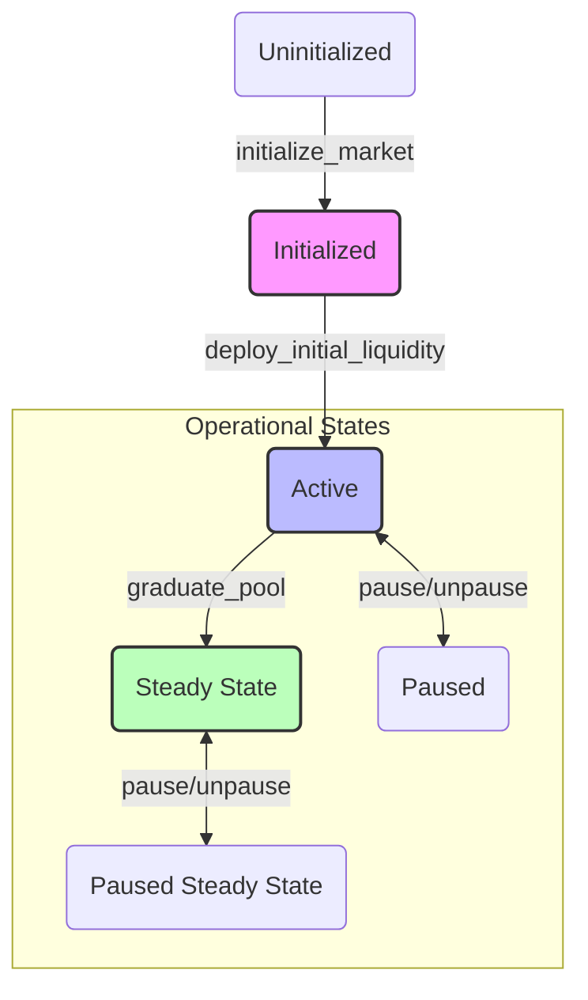

# 301: Market State and Lifecycle

## 1. Overview

This document covers one of the most critical and complex aspects of the system, the `Market` state account. It is intended for developers, auditors, and integrators to understand the market's lifecycle as a state machine, its safety guarantees, and the mechanics of its advanced features.

## 2. The `Market` State Account

The `Market` account holds all configuration and real-time state for a single trading pair. Its fields can be broken down into several logical groups.

| Category                  | Key Fields                                                               | Description                                                                 |
| ------------------------- | ------------------------------------------------------------------------ | --------------------------------------------------------------------------- |
| **Core Configuration**    | `token_0`, `token_1`, `tick_spacing`, `authority`                        | Defines the trading pair and fundamental, immutable parameters.             |
| **AMM State**             | `sqrt_price`, `liquidity`, `current_tick`, `fee_growth_global_*`         | Real-time state of the concentrated liquidity pool.                         |
| **Phase Management**      | `phase`, `phase_start_slot`, `total_volume_*`                            | Tracks the market's current lifecycle phase and metrics for graduation.     |
| **JIT Liquidity**         | `jit_enabled`, `jit_*_cap_bps`, `rolling_*_volume`                       | Parameters for the Just-In-Time liquidity and circuit breaker mechanism.    |
| **POMM & Floor**          | `floor_tick`, `floor_buffer_ticks`, `last_floor_ratchet_ts`              | Parameters for Protocol-Owned Market Making and the price floor ratchet.    |
| **Security & Status**     | `is_paused`, `reentrancy_guard`, `*_bump`                                | Flags and PDA bumps for operational security and integrity.                 |

## 3. The Market Lifecycle (State Machine)

The market progresses through a defined set of phases, each triggered by a specific instruction under a set of strict conditions. This ensures that markets behave predictably from creation to maturity.

### Phase Transitions

#### A. `Uninitialized -> Initialized`
- **Triggering Instruction**: `initialize_market`
- **Description**: A new market account is created and configured. It exists on-chain but has no liquidity and cannot be traded against.
- **Conditions**:
    - The `Market` account must not already exist.
    - One of the tokens must be the `FeelsSOL` hub token.
    - An initial liquidity commitment is made, but not yet deposited.
- **State Changes**:
    - `is_initialized` is set to `true`.
    - `phase` is set to `Initialized`.
    - All core configuration fields are set.
    - `initial_liquidity_deployed` is `false`.

#### B. `Initialized -> Active`
- **Triggering Instruction**: `deploy_initial_liquidity`
- **Description**: The committed initial liquidity is deposited into the market, enabling trading.
- **Conditions**:
    - `phase` must be `Initialized`.
    - `initial_liquidity_deployed` must be `false`.
    - The deposited liquidity must match the commitment made in `initialize_market`.
- **State Changes**:
    - `phase` is set to `Active`.
    - `initial_liquidity_deployed` is set to `true`.
    - `market.liquidity` is updated.

#### C. `Active -> Steady State`
- **Triggering Instruction**: `graduate_pool` (Permissionless Crank)
- **Description**: The market has met criteria for maturity (e.g., sufficient volume and time) and transitions to a standard, long-term operational state.
- **Conditions**:
    - `phase` must be `Active`.
    - Cumulative volume (`total_volume_token_0`, `total_volume_token_1`) must exceed a governance-defined threshold.
    - Time since initialization must exceed a governance-defined duration.
- **State Changes**:
    - `phase` is set to `SteadyState`.
    - `steady_state_seeded` is set to `true`.

#### D. `Active <-> Paused`
- **Triggering Instruction**: `update_market_status` (Authority Only)
- **Description**: The market authority can temporarily halt all trading activity in the pool.
- **Conditions**: Can be triggered at any time by the market authority.
- **State Changes**:
    - `is_paused` is toggled `true`/`false`.

## 4. Key Parameter Groups Explained

### JIT (Just-In-Time) Liquidity Parameters

These parameters control the experimental JIT liquidity feature, which aims to provide deep, temporary liquidity for large swaps while protecting the protocol from exploitation.

| Parameter                   | Type     | Description                                                                                             |
| --------------------------- | -------- | ------------------------------------------------------------------------------------------------------- |
| `jit_enabled`               | `bool`   | Master switch to enable or disable JIT functionality for this market.                                   |
| `jit_base_cap_bps`          | `u16`    | The maximum percentage of the buffer's total assets (τ) that can be used for JIT liquidity.               |
| `jit_per_slot_cap_bps`      | `u16`    | The maximum percentage of the buffer that can be used in a single slot to prevent draining.             |
| `jit_concentration_width`   | `u32`    | The number of ticks away from the current price where JIT liquidity is considered most effective.       |
| `jit_max_multiplier`        | `u8`     | A multiplier to amplify the JIT liquidity effect.                                                       |
| `jit_drain_protection_bps`  | `u16`    | A threshold (e.g., 70%) of buffer usage at which JIT provisioning is throttled to prevent draining.      |
| `jit_circuit_breaker_bps`   | `u16`    | A price movement threshold (e.g., 30% in 1hr) that, if exceeded, halts JIT to prevent oracle attacks. |
| `rolling_*_volume`          | `u128`   | Rolling window of buy/sell volume used to detect imbalanced, potentially manipulative activity.         |
| `tick_snapshot_1hr`         | `i32`    | A snapshot of the market tick from one hour ago, used by the circuit breaker.                           |

### POMM (Protocol-Owned Market Making) & Floor Parameters

These parameters govern the protocol's own liquidity strategies and the price floor ratchet mechanism, designed to improve liquidity depth and provide some downside protection.

| Parameter                 | Type    | Description                                                                                              |
| ------------------------- | ------- | -------------------------------------------------------------------------------------------------------- |
| `floor_tick`              | `i32`   | The current floor price, represented as a tick. The market price is discouraged from falling below this. |
| `floor_buffer_ticks`      | `i32`   | The distance (in ticks) below the current price to set a new candidate floor during a ratchet.         |
| `last_floor_ratchet_ts`   | `i64`   | The timestamp of the last time the floor was raised.                                                     |
| `floor_cooldown_secs`     | `i64`   | The minimum time that must pass before the floor can be ratcheted up again, preventing manipulation.   |

