# Architecture Map

Visual guides to system architecture, component relationships, and data flow.

## System Overview Diagram

High-level view of the Feels Protocol architecture showing the hub-and-spoke model and key components.

## Document Dependency Graph

Shows reading order and dependencies between specification documents.

**Legend**:
- 🟢 Foundation (read first)
- 🔵 Core (essential mechanisms)
- 🔴 Advanced (build on core)
- 🟡 Operations (sequences)
- 🟣 Governance (config/safety)

## Component Integration Map

Shows how unified components integrate across the protocol.

## Swap Flow Diagram

Detailed sequence showing a swap execution through the system.

## Token Launch Flow

Complete flow from token creation through graduation.

```mermaid
sequenceDiagram
    participant Creator
    participant Escrow as PreLaunchEscrow
    participant Pool as Pool/Market
    participant Bonding as Bonding Curve
    participant Floor as Floor POL
    participant JIT as JIT POL
    
    Note over Creator: Has 3000 FeelsSOL
    
    Creator->>Escrow: mint_token(1000 FeelsSOL fee)
    Note over Escrow: Holds 1B tokens + fee
    
    Creator->>Pool: initialize_market(price)
    Note over Pool: Revoke mint/freeze authority
    Pool->>Escrow: Link to market
    
    Creator->>Bonding: deploy_initial_liquidity
    Escrow->>Bonding: Transfer 1B tokens
    Escrow->>Pool: Transfer mint fee to treasury
    Note over Bonding: Deploy 10-40 staircase ranges
    
    opt Initial Buy
        Creator->>Bonding: swap(1000 FeelsSOL)
        Bonding-->>Creator: ~1M tokens
    end
    
    Note over Pool,Bonding: Phase 1: Price Discovery<br/>Public trading, no LP positions
    
    loop Trading
        Traders->>Bonding: swaps
        Bonding->>Pool: Accumulate fees
    end
    
    Note over Pool: Market cap target met!
    
    Anyone->>Pool: graduate_pool (crank)
    
    Pool->>Floor: Deploy 95% capital
    Note over Floor: Single-sided at floor tick
    
    Pool->>JIT: Seed 5% capital
    Note over JIT: Bootstrap PoolBuffer τ
    
    Bonding->>Pool: Withdraw staircase positions
    
    Note over Pool: Phase 2: Steady State<br/>Floor + JIT + Open to LPs
```

## Fee Distribution Flow

How swap fees are split and allocated.

## Safety Controller Decision Tree

How SafetyController responds to different conditions.

## Component State Dependencies

Shows which state each component reads and writes.

## Read Order Optimization

Suggested reading order to minimize context loading for common tasks.

### Implementing Swaps

```mermaid
graph LR
    Start([Start]) --> CLMM[203: CLMM §4.4<br/>~50 lines]
    CLMM --> Fees[201: Fees §4<br/>~100 lines]
    Fees --> Pipeline[208: Pipeline<br/>~59 lines]
    Pipeline --> Done([Done<br/>~200 lines total])
    
    classDef readClass fill:#e1f5e1,stroke:#2d5016
    class Start,CLMM,Fees,Pipeline,Done readClass
```

### Launching Tokens

```mermaid
graph LR
    Start([Start]) --> Launch[300: Launch<br/>~390 lines]
    Launch --> Bonding[207: Bonding §2-3<br/>~200 lines]
    Bonding --> Lifecycle[301: Lifecycle §3<br/>~100 lines]
    Lifecycle --> Done([Done<br/>~700 lines total])
    
    classDef readClass fill:#f5f5e1,stroke:#505016
    class Start,Launch,Bonding,Lifecycle,Done readClass
```

### Understanding Solvency

```mermaid
graph LR
    Start([Start]) --> Solvency[200: Solvency §1-2<br/>~150 lines]
    Solvency --> Floor[205: Floor §3<br/>~100 lines]
    Floor --> Safety[210: Safety<br/>~64 lines]
    Safety --> Done([Done<br/>~300 lines total])
    
    classDef readClass fill:#e1e5f5,stroke:#162d50
    class Start,Solvency,Floor,Safety,Done readClass
```

## Module Dependency Map (Code)

Maps code modules to their documentation.

## Data Flow: Swap Execution

Detailed data flow showing how information moves through a swap.

```mermaid
flowchart TD
    Start([User initiates swap]) --> Input[amount_in, min_out,<br/>sqrt_price_limit, max_fee_bps]
    
    Input --> LoadState[Load Pool State<br/>current tick, sqrt_price, liquidity]
    
    LoadState --> JITCheck{JIT<br/>Enabled?}
    
    JITCheck -->|Yes| JITGuards[Check JIT Guards<br/>oracle health, budgets, floor]
    JITCheck -->|No| ExecuteSwap[Execute CLMM Swap Loop]
    
    JITGuards --> JITPlace[Place Contrarian Liquidity<br/>around GTWAP anchor]
    JITPlace --> ExecuteSwap
    
    ExecuteSwap --> TickLoop[Cross Ticks<br/>consume liquidity, update price]
    TickLoop --> SwapResult[amount_out, end_tick,<br/>ticks_crossed]
    
    SwapResult --> JITRemove{JIT<br/>Active?}
    JITRemove -->|Yes| RemoveJIT[Remove Unfilled JIT<br/>calculate toxicity]
    JITRemove -->|No| CalcFee[Calculate Fee<br/>start_tick → end_tick]
    RemoveJIT --> CalcFee
    
    CalcFee --> FeeCheck{fee_bps ≤<br/>max_fee_bps?}
    FeeCheck -->|No| Revert([Revert: Fee Exceeds Cap])
    FeeCheck -->|Yes| ApplyFee[amount_out - fees]
    
    ApplyFee --> MinCheck{amount_out ≥<br/>min_out?}
    MinCheck -->|No| Revert2([Revert: Slippage])
    MinCheck -->|Yes| Transfer[Transfer Tokens]
    
    Transfer --> UpdateOracle[Update market::Oracle<br/>new tick, timestamp]
    UpdateOracle --> UpdateFlow[Update FlowSignals<br/>flow_ewma, toxicity]
    UpdateFlow --> SplitFees[Split Fees<br/>LP, Reserve, Buffer, Treasury]
    SplitFees --> RatchetCheck{Can<br/>Ratchet?}
    
    RatchetCheck -->|Yes| RatchetFloor[Ratchet Floor Up]
    RatchetCheck -->|No| SafetyObserve[SafetyController Observe]
    RatchetFloor --> SafetyObserve
    
    SafetyObserve --> EmitEvent[Emit SwapExecuted Event]
    EmitEvent --> Done([Success])
    
    classDef inputClass fill:#e1f5e1,stroke:#2d5016
    classDef processClass fill:#e1e5f5,stroke:#162d50
    classDef decisionClass fill:#f5f5e1,stroke:#505016
    classDef errorClass fill:#f5e1e1,stroke:#501616
    
    class Start,Input,Done inputClass
    class LoadState,ExecuteSwap,TickLoop,CalcFee,Transfer,UpdateOracle,UpdateFlow,SplitFees,RatchetFloor,SafetyObserve,EmitEvent processClass
    class JITCheck,JITRemove,FeeCheck,MinCheck,RatchetCheck decisionClass
    class Revert,Revert2 errorClass
```

## Component Interaction Summary

Quick reference table for component interactions.

| Component | Reads From | Writes To | Used By | Documents |
|-----------|-----------|-----------|---------|-----------|
| **market::Oracle** | Pool.current_tick | OracleState.observations | Fees, JIT, Floor | 204 |
| **market::Floor** | PoolFloor state, Pool state | PoolFloor.current_floor | Fees, JIT, Controller | 205, 200 §7 |
| **FlowSignals** | Swap results, JIT results | flow_ewma, toxicity | Fees, JIT | 201 §9 |
| **SafetyController** | Oracle health, metrics | Health status, pauses | All operations | 210, 200 §6.3 |
| **PoolController** | Fee amounts, phase | Fee splits, allocations | After-swap, Launch | 206 |
| **Dynamic Fees** | Oracle, Floor, Flow | fee_bps | Swap instruction | 201 |
| **JIT System** | Oracle, Floor, Buffer | PoolBuffer, toxicity | Swap instruction | 202 |

## See Also

- **[DOCS-INDEX.md](DOCS-INDEX.md)**: Task-based navigation guide
- **[GLOSSARY.md](GLOSSARY.md)**: Terms and abbreviations
- **[CONCEPT-CARDS.md](CONCEPT-CARDS.md)**: Quick component summaries
- **[README.md](../../../README.md)**: Build and development setup

