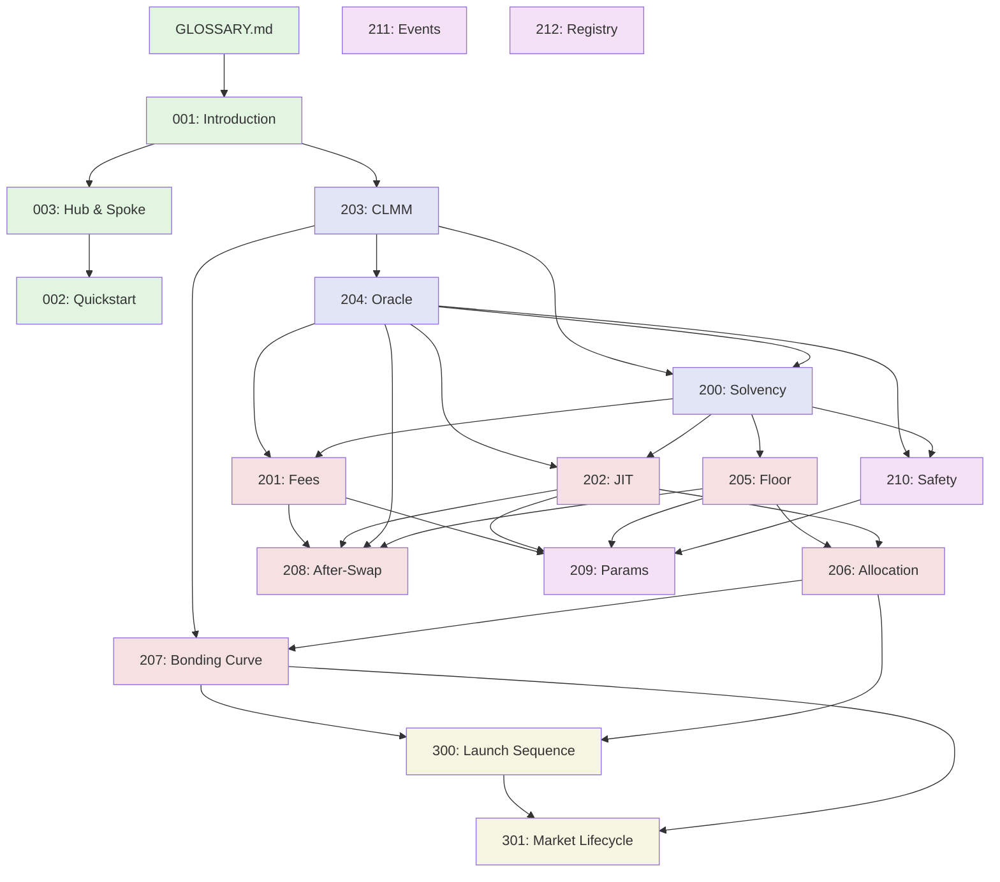

# Feels Protocol Documentation Index

This guide helps you navigate the documentation efficiently based on your specific needs. Use the task-based navigation below to find the minimal set of documents needed for your work.

## Quick Start by Role

### For AI Agents
Start here for efficient context loading:
1. Read [GLOSSARY.md](GLOSSARY.md) first for terminology
2. Use task-based navigation below to load only relevant docs
3. Reference [CONCEPT-CARDS.md](CONCEPT-CARDS.md) for quick component summaries
4. See [ARCHITECTURE-MAP.md](ARCHITECTURE-MAP.md) for system dependencies

### For Developers
1. **New to protocol**: [001-introduction.md](001-introduction.md) → [003-hub-and-spoke-architecture.md](003-hub-and-spoke-architecture.md)
2. **Integrating**: [002-quickstart.md](002-quickstart.md) → Task-based sections below

### For Auditors
Priority reading order:
1. [200-feelssol-solvency.md](200-feelssol-solvency.md) - Solvency model
2. [210-safety-controller.md](210-safety-controller.md) - Safety mechanisms
3. [203-pool-clmm.md](203-pool-clmm.md) - Core AMM
4. [202-jit-liquidity.md](202-jit-liquidity.md) - Automated strategies

## Task-Based Navigation

### Understanding Trading

**"How do swaps work?"**
```
203-pool-clmm.md (§4.4: swap instruction)
  ↓
201-dynamic-fees.md (§4: MVP fee model - base + impact only)
  ↓
208-after-swap-pipeline.md (post-execution updates)
```
**Estimated reading**: ~400 lines

**"What determines trading fees?"**
```
201-dynamic-fees.md (§4: Fee Calculation)
  + §5: Fee Distribution
```
**Estimated reading**: ~150 lines

**"How does routing work?"**
```
003-hub-and-spoke-architecture.md (complete)
  ↓
README.md (§Quick Start: Trading Flow)
```
**Estimated reading**: ~120 lines

### Launching Tokens

**"Complete launch process"**
```
300-launch-sequence.md (complete walkthrough)
  ↓
207-bonding-curve-feels.md (price discovery phase)
  ↓
301-market-state-and-lifecycle.md (lifecycle phases)
```
**Estimated reading**: ~700 lines

**"Just the instruction sequence"**
```
300-launch-sequence.md (§Steps 1-4 only)
```
**Estimated reading**: ~250 lines

**"Understanding bonding curves"**
```
207-bonding-curve-feels.md (§2-3: Core Principles & Implementation)
```
**Estimated reading**: ~200 lines

### Working with Liquidity

**"Adding liquidity positions"**
```
203-pool-clmm.md (§1: Core Concepts, §4.2: open_position)
```
**Estimated reading**: ~250 lines

**"Understanding concentrated liquidity"**
```
203-pool-clmm.md (§1-3: concepts, data structures, math)
```
**Estimated reading**: ~300 lines

**"Protocol-owned liquidity"**
```
205-floor-liquidity.md (§1-3: Floor mechanism)
  ↓
202-jit-liquidity.md (§2: JIT overview, MVP v0.5)
  ↓
206-pool-allocation.md (how capital is allocated)
```
**Estimated reading**: ~500 lines

### Understanding Oracles and Pricing

**"How are prices determined?"**
```
204-pool-oracle.md (§2-4: GTWAP mechanics)
```
**Estimated reading**: ~150 lines

**"FeelsSOL backing and solvency"**
```
200-feelssol-solvency.md (§1-2: Architecture & Solvency Model)
  ↓
§6: Oracle Architecture (protocol vs pool oracles)
```
**Estimated reading**: ~300 lines

**"Price manipulation resistance"**
```
204-pool-oracle.md (§5: Security and Manipulation Resistance)
  ↓
210-safety-controller.md (§2: Actions Matrix)
```
**Estimated reading**: ~100 lines

### Safety and Risk Management

**"Safety mechanisms overview"**
```
210-safety-controller.md (complete)
  ↓
200-feelssol-solvency.md (§3: Risk Analysis, §6.3: Safety Controller)
```
**Estimated reading**: ~200 lines

**"Circuit breakers and degraded modes"**
```
210-safety-controller.md (§2: Actions Matrix)
  ↓
209-params-and-governance.md (§Pausing / Degrade Scopes)
```
**Estimated reading**: ~100 lines

**"Solvency guarantees"**
```
200-feelssol-solvency.md (§2: Two-Layer Solvency Model, §5: Invariants)
  ↓
205-floor-liquidity.md (§2.1: Pool-Level Solvency)
```
**Estimated reading**: ~250 lines

### Configuration and Governance

**"Protocol parameters"**
```
209-params-and-governance.md (§ProtocolParams)
  ↓
211-events-and-units.md (unit conventions)
```
**Estimated reading**: ~150 lines

**"Governance mechanisms"**
```
209-params-and-governance.md (complete)
```
**Estimated reading**: ~140 lines

**"Fee configuration"**
```
201-dynamic-fees.md (§Parameters - flat, explicit for MVP)
  ↓
206-pool-allocation.md (§2.2: Fee Distribution)
```
**Estimated reading**: ~100 lines

## Document Hierarchy

### Foundation (Read First)
Essential documents providing protocol overview and core concepts.

```
├── GLOSSARY.md ⭐ (START HERE)
│   └── Quick reference for all terms and abbreviations
│
├── 001-introduction.md
│   └── Protocol overview and key features
│   └── Prerequisites: None
│
├── 003-hub-and-spoke-architecture.md
│   └── Routing model and FeelsSOL hub
│   └── Prerequisites: 001
│
└── 002-quickstart.md
    └── User guide for basic operations
    └── Prerequisites: 001, 003
```

### Core Mechanisms (Read as Needed)
Fundamental protocol mechanics that other systems build upon.

```
├── 203-pool-clmm.md
│   └── Concentrated liquidity AMM mechanics
│   └── Prerequisites: 001, GLOSSARY
│   └── Used by: All trading-related docs
│
├── 204-pool-oracle.md
│   └── GTWAP oracle implementation
│   └── Prerequisites: 203 (§1: ticks)
│   └── Used by: 201, 202, 205, 210
│
└── 200-feelssol-solvency.md ⚠️ LONG (668 lines)
    └── Solvency model and backing mechanics
    └── Prerequisites: 203, 204
    └── Used by: 205, 210
    └── Tip: Read §1-2 first, then §6-7 for components
```

### Advanced Features (Read When Implementing)
Sophisticated systems building on core mechanisms.

```
├── 201-dynamic-fees.md ⚠️ LONG (905 lines)
│   └── Fee calculation model (MVP: base + impact)
│   └── Prerequisites: 204, 200 (§7: market::Floor)
│   └── Phase 2 features: §6-8 (deferred)
│   └── Tip: For MVP, read §4-5 only (~200 lines)
│
├── 202-jit-liquidity.md ⚠️ LONG (598 lines)
│   └── Just-in-time protocol liquidity (MVP: v0.5)
│   └── Prerequisites: 204, 200 (§7), GLOSSARY (τ, toxicity)
│   └── Tip: Read §2-3 for overview, §MVP Mode for implementation
│
├── 205-floor-liquidity.md
│   └── Protocol-owned floor mechanism
│   └── Prerequisites: 200 (§7: market::Floor)
│   └── Used by: 201, 202, 206
│
├── 206-pool-allocation.md
│   └── Fee splits and capital allocation
│   └── Prerequisites: 202, 205
│   └── Used by: 300, 301
│
├── 207-bonding-curve-feels.md
│   └── Token launch bonding curve
│   └── Prerequisites: 203, 206
│   └── Used by: 300, 301
│
└── 208-after-swap-pipeline.md
    └── Post-swap processing sequence
    └── Prerequisites: 201, 202, 204, 205, 210
    └── Tip: Concise (59 lines), read complete
```

### Protocol Operations (Read for Sequences)
Step-by-step flows and lifecycle management.

```
├── 300-launch-sequence.md
│   └── Complete token launch walkthrough
│   └── Prerequisites: 207, 206
│   └── Includes: Mermaid diagrams with example flows
│
└── 301-market-state-and-lifecycle.md
    └── Market phases and state transitions
    └── Prerequisites: 207, 300
    └── Includes: State machine diagram
```

### Governance and Safety (Read for Operations)
Configuration, parameters, and safety systems.

```
├── 209-params-and-governance.md
│   └── Protocol parameters and governance
│   └── Prerequisites: 201, 202, 205
│
├── 210-safety-controller.md
│   └── Risk management and circuit breakers
│   └── Prerequisites: 204, 200 (§6.3)
│
├── 211-events-and-units.md
│   └── Event definitions and unit conventions
│   └── Prerequisites: GLOSSARY
│
└── 212-pool-registry.md
    └── Pool registration system
    └── Prerequisites: None
    └── Tip: Concise (38 lines)
```

## Component Cross-Reference Matrix

Shows which documents define and which consume each major component.

| Component | Defined In | Primary Usage | Related Reading |
|-----------|------------|---------------|-----------------|
| **market::Oracle** | 204 | 201 (fees), 202 (JIT), 205 (floor) | 210 (health monitoring) |
| **market::Floor** | 200 §7, 205 §3 | 201 (equilibrium), 202 (floor guard), 206 (allocation) | 210 (invariants) |
| **PoolController** | 206 | 300 (launch), 301 (lifecycle), 208 (after-swap) | 209 (params) |
| **SafetyController** | 210, 200 §6.3 | 202 (JIT), 201 (fees), 208 (observe) | 209 (degrade scopes) |
| **FlowSignals** | 201 §9 | 202 (toxicity), 201 (momentum) | 208 (updates) |
| **PoolBuffer (τ)** | 206 §2.2 | 202 (JIT budget), 201 (fee split) | 205 (seed capital) |
| **PoolReserve** | 205, 206 | 205 (floor capital), 206 (allocation) | 200 (solvency) |

## Reading Strategies for Long Documents

### 200-feelssol-solvency.md (668 lines)
**Incremental approach**:
1. **Essential**: §1-2 (Architecture, Solvency Model) - 150 lines
2. **Risk analysis**: §3 (Risk Analysis) - 100 lines  
3. **Components**: §6-7 (Oracle, Floor) - 200 lines
4. **Advanced**: §4-5, §8-10 (scenarios, details) - remaining

**Skip if**: Not working on solvency, reserves, or oracles

### 201-dynamic-fees.md (905 lines)
**Incremental approach**:
1. **MVP only**: §4-5 (Fee Calculation, Distribution) - 200 lines
2. **Integration**: §Integration with Swap - 100 lines
3. **Phase 2**: §6-8 (Momentum, Equilibrium, Warmup) - deferred

**Skip if**: Not implementing fee logic (most integrations)

### 202-jit-liquidity.md (598 lines)
**Incremental approach**:
1. **Overview**: §1-2 (Context, Decision, MVP Mode) - 150 lines
2. **Safety**: §Safety Mitigations (JIT v0.5) - 100 lines
3. **Integration**: §Integration with Unified Architecture - 50 lines
4. **Details**: §Anchor, Budgets, State - as needed

**Skip if**: Not implementing JIT or working with PoolBuffer

## Dependency Graph

Visual representation showing document dependencies (read prerequisites first):



## Code-to-Doc Quick Reference

When reading code, these mappings help you find relevant documentation:

### Instructions
| Instruction | Primary Doc | Related |
|-------------|-------------|---------|
| `swap` | 203 §4.4 | 201 §Integration, 208 |
| `open_position` | 203 §4.2 | 203 §1.2 (positions) |
| `close_position` | 203 §4.3 | 203 §5 (fees) |
| `enter_feelssol` | 300 §1 | 200 §1.2 (flow) |
| `exit_feelssol` | 300 §7 | 200 §6 (oracle), 210 |
| `mint_token` | 300 §2 | 207 §4 (lifecycle) |
| `initialize_market` | 300 §3 | 301 §3 (phases) |
| `deploy_initial_liquidity` | 300 §4 | 207 §3, 300 §4 |
| `graduate_pool` | 300 §6 | 301 §3, 207 §4.2 |

### State Accounts
| Account | Primary Doc | State Details |
|---------|-------------|---------------|
| `Pool` / `Market` | 203 §2.1 | 301 §2 (full fields) |
| `Position` | 203 §2.3 | 203 §1.2 (mechanics) |
| `TickArray` | 203 §2.2 | 203 §1.3 (lazy init) |
| `OracleState` | 204 §3.1 | 204 §4 (how it works) |
| `PoolFloor` | 205 §3.1 | 200 §7 (integration) |
| `PoolController` | 206 §4.1 | 206 §2-3 (responsibilities) |
| `SafetyController` | 210 | 200 §6.3 (protocol-wide) |
| `PreLaunchEscrow` | 300 §2 | 300 (lifecycle) |

### Logic Modules
| Module | Primary Doc | Notes |
|--------|-------------|-------|
| `liquidity_math.rs` | 203 §3.2 | Orca core wrappers |
| `tick_operations.rs` | 203 §4.4 | Tick crossing logic |
| `fee_calculation.rs` | 201 §4 | MVP: base + impact |
| `jit_*.rs` | 202 | Multiple files, see §Design |
| `oracle_*.rs` | 204 | GTWAP ring buffer |

## Tips for AI Agents

### Efficient Context Loading
1. **Always read GLOSSARY.md first** (~200 lines) to understand terminology
2. **Use concept cards** before reading full docs
3. **Read only needed sections** of long documents (200, 201, 202)
4. **Follow task-based navigation** rather than reading sequentially
5. **Check component matrix** to understand relationships

### Token Budget Optimization
- **Small query** (e.g., "what is GTWAP?"): GLOSSARY only (~20 lines)
- **Medium query** (e.g., "how do swaps work?"): 3-4 sections (~400 lines)
- **Large query** (e.g., "implement token launch"): Full flow (~700 lines)

### Caching Strategy
Cache these frequently referenced documents:
1. GLOSSARY.md - Referenced by all queries
2. 203-pool-clmm.md §1-2 - Core concepts
3. 001-introduction.md - Overview
4. CONCEPT-CARDS.md - Quick summaries

### When to Read Full Documents
Only read complete long documents when:
- Implementing the specific feature (fees, JIT, solvency)
- Auditing the system thoroughly
- Working on cross-cutting changes

Otherwise, use sections and incremental loading.

## Document Statistics

For planning context budget:

| Document | Lines | Read Time* | Priority |
|----------|-------|-----------|----------|
| GLOSSARY.md | ~450 | 2 min | ⭐ Always |
| 001-introduction.md | ~30 | 10 sec | High |
| 003-hub-and-spoke-architecture.md | ~60 | 20 sec | High |
| 203-pool-clmm.md | ~240 | 1 min | High |
| 204-pool-oracle.md | ~150 | 45 sec | Medium |
| 200-feelssol-solvency.md | ~670 | 3 min | As needed |
| 201-dynamic-fees.md | ~905 | 4 min | As needed |
| 202-jit-liquidity.md | ~598 | 3 min | As needed |
| 205-floor-liquidity.md | ~150 | 45 sec | Medium |
| 300-launch-sequence.md | ~390 | 2 min | For launches |

*Estimated at ~250 lines/minute reading speed

## Next Steps

After reading relevant documentation:
1. Check [CONCEPT-CARDS.md](CONCEPT-CARDS.md) for quick component reference
2. See [ARCHITECTURE-MAP.md](ARCHITECTURE-MAP.md) for system diagrams
3. Review code in `programs/feels/src/` with doc mappings above
4. Consult [209-params-and-governance.md](209-params-and-governance.md) for configuration

