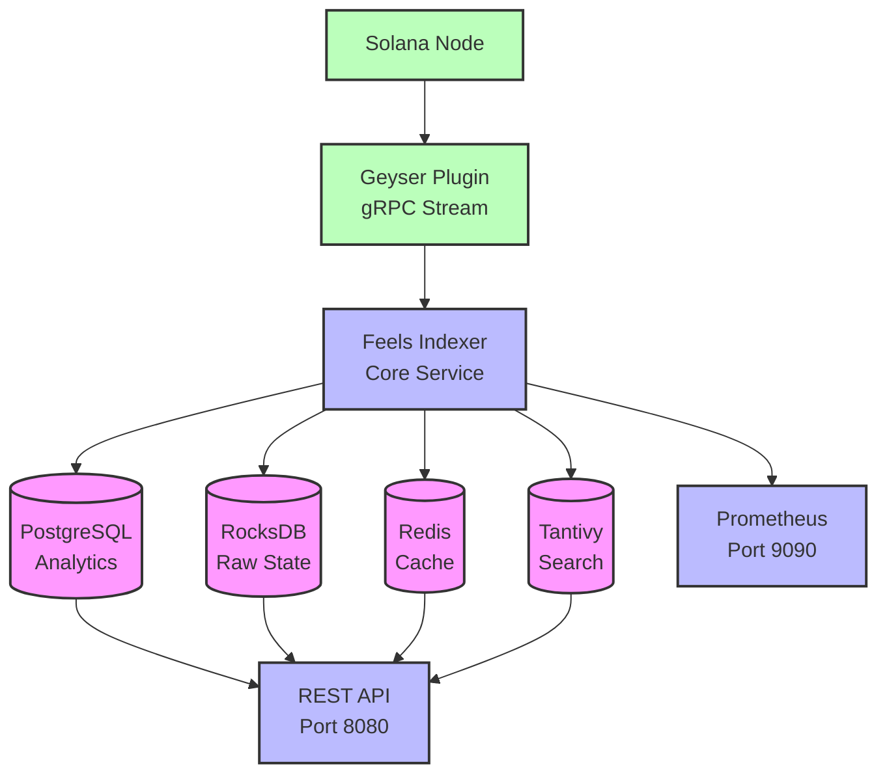

# Feels Protocol Indexer

Multi-tier real-time indexer for Feels Protocol on Solana with PostgreSQL, Redis caching, Tantivy search, and RocksDB storage.

## Overview

The Feels Indexer provides comprehensive protocol state indexing with:

- **Multi-tier Storage**: PostgreSQL for relational queries, RocksDB for raw data, Redis for caching
- **Full-text Search**: Tantivy integration for market and position discovery
- **Real-time Updates**: Geyser gRPC streaming from Solana validator
- **REST API**: Complete HTTP API for all protocol data
- **Monitoring**: Prometheus metrics and structured logging

## Components

### Indexer Core (`src/`)
The main indexer service that processes blockchain data, maintains multiple storage backends, and provides a REST API.

### Geyser Plugin (`geyser-plugin/`)
A Geyser gRPC plugin that runs **as part of the Solana validator node** (not as a separate service). The plugin:
- Integrates with the validator's transaction processing pipeline
- Streams account updates and transaction data in real-time via gRPC
- Feeds data directly to the indexer core service

**Note:** The Geyser plugin is loaded by the Solana validator at startup via the `--geyser-plugin-config` flag. It runs in the validator's process space, making it a critical infrastructure component rather than a standalone application.

## Architecture



## Quick Start

### Prerequisites

- Nix with flakes enabled
- Access to Solana RPC (Geyser plugin optional)

### Development Setup

1. **Enter the Nix development shell:**
   ```bash
   nix develop .#indexer
   ```

2. **Setup database:**
   ```bash
   createdb feels_indexer
   export DATABASE_URL="postgresql://localhost/feels_indexer"
   sqlx migrate run
   ```

3. **Configure the indexer:**
   ```bash
   cp indexer.toml indexer.local.toml
   # Edit indexer.local.toml with your settings
   ```

4. **Run the indexer:**
   ```bash
   cargo run --release
   ```

### Configuration

Edit `indexer.toml` to customize:

```toml
[geyser]
endpoint = "http://localhost:10000"  # Yellowstone gRPC endpoint (local only - change for devnet/mainnet)
program_id = "Cbv2aa2zMJdwAwzLnRZuWQ8efpr6Xb9zxpJhEzLe3v6N"

[storage]
rocksdb_path = "../localnet/indexer-storage/rocksdb"
enable_compression = true

[api]
bind_address = "127.0.0.1:8080"
enable_cors = true

[monitoring]
metrics_port = 9090
log_level = "info"
```

## API Endpoints

### Markets
- `GET /markets` - List all markets
- `GET /markets/{address}` - Get market details
- `GET /markets/{address}/stats` - Market statistics
- `GET /markets/{address}/swaps` - Market swap history
- `GET /markets/{address}/floor` - Floor price history
- `GET /markets/{address}/ohlcv` - Price candles

### Swaps
- `GET /swaps` - List recent swaps
- `GET /swaps/{signature}` - Get swap details
- `GET /users/{address}/swaps` - User swap history

### Positions
- `GET /positions` - List positions
- `GET /positions/{address}` - Get position details
- `GET /users/{address}/positions` - User positions

### Protocol
- `GET /protocol/stats` - Protocol-wide statistics
- `GET /protocol/volume` - Volume analytics

### Health & Monitoring
- `GET /health` - Health check
- `GET /metrics` - Prometheus metrics (port 9090) - **Note: Currently returns placeholder "TODO" message**

## Development

### Building

```bash
# Debug build
cargo build

# Release build (recommended)
cargo build --release

# Check without building
cargo check
```

### Testing

```bash
# Run all tests
cargo test

# Run specific test
cargo test test_market_storage

# With logging
RUST_LOG=debug cargo test
```

## Data Models

### Market State
```rust
pub struct IndexedMarket {
    pub address: Pubkey,
    pub token_0: Pubkey,
    pub token_1: Pubkey,
    pub sqrt_price: u128,
    pub liquidity: u128,
    pub current_tick: i32,
    pub phase: PoolPhase,
    // ... analytics fields
}
```

### Swap Transaction
```rust
pub struct IndexedSwap {
    pub signature: String,
    pub market: Pubkey,
    pub user: Pubkey,
    pub amount_in: u64,
    pub amount_out: u64,
    pub price_impact_bps: u16,
    // ... detailed metrics
}
```

### Floor Liquidity
```rust
pub struct IndexedFloor {
    pub market: Pubkey,
    pub current_floor_tick: i32,
    pub current_floor_price: f64,
    pub jitosol_reserves: u128,
    pub circulating_supply: u128,
    // ... ratchet history
}
```

## Storage Architecture

### PostgreSQL (Primary Analytics)
- Markets, swaps, positions with full indexing
- Time-series data for OHLCV and analytics
- Complex queries and aggregations

### RocksDB (Raw State)
- Account state snapshots
- Transaction history
- Column families: markets, swaps, positions, floors, buffers

### Redis (Cache Layer)
- Hot data: recent swaps, active markets
- Real-time price updates
- User position summaries

### Tantivy (Search)
- Full-text search on markets
- Token symbol/name discovery
- Fast prefix matching

## Monitoring

### Metrics (Prometheus)

- `feels_indexer_accounts_processed_total` - Account updates processed
- `feels_indexer_transactions_processed_total` - Transactions processed
- `feels_indexer_storage_operations_total` - Database operations
- `feels_indexer_geyser_connection_status` - Stream connection health
- `feels_indexer_processing_latency_seconds` - Update processing time

### Logs

Structured JSON logging with configurable levels:

```bash
# Set log level
export RUST_LOG=feels_indexer=debug,yellowstone_grpc_client=info

# View logs
cargo run 2>&1 | jq '.'
```

## Performance Tuning

1. **Database Optimization**
   - PostgreSQL: Tune `shared_buffers` and `work_mem`
   - RocksDB: Adjust `write_buffer_size_mb` for throughput
   - Redis: Configure `maxmemory-policy` for cache eviction

2. **Indexer Performance**
   - Increase `batch_size` for bulk operations
   - Tune `flush_interval_secs` for write latency
   - Monitor memory usage with `max_lag_slots`

3. **API Optimization**
   - Enable response caching
   - Use database connection pooling
   - Implement request coalescing
